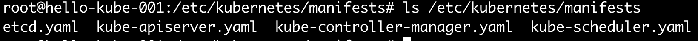

## setup
kubernetes setup은 수동으로 할 수도 있지만, kubeadm을 통해 설치하면 편하다.
마스터 노드에는 `etcd`, `api-server`, `kube-controller-manager`, `scheduler` 등 kubernetes 관리를 위한 관리 컴포넌트가 필요하다.  

kubeadm은 이 Pod들을 어떻게 띄울까? 자세히 살펴볼 일이 없었지만, 이들은 다 설치 파일이 있다.
`/etc/kubernetes/manifests`에 있다.

~~~
$ ls /etc/kubernetes/manifests
~~~

## etcd
`etcd`는 key-value 데이터베이스이며, kubernetes의 마스터 노드에 위치하여 각종 정보들을 저장한다.  
`etcd`는 오픈소스이며, kubernetes 설치 시에 Pod로 생성하지 않고 별도의 서버에 세팅할 수도 있다.
`kubeadm`을 통해 설치하면, 마스터 노드에 Pod로 생성된다.

##### etcd Pod
`etcdctl`의 기본명령어를 실행해보자.
~~~
$ kubectl exec etcd-hello-kube-001 -n kube-system  -- sh -c "etcdctl get / --prefix --keys-only --limit=10 --cacert /etc/kubernetes/pki/etcd/ca.crt --cert /etc/kubernetes/pki/etcd/server.crt  --key /etc/kubernetes/pki/etcd/server.key"
~~~

## api-server
`kubectl`은 `api-server`를 호출하는 cli이다. `api-server`는 `etcd`와 통신하는 유일한 컴포넌트이다. 

~~~
$ ps -aux | grep kube-apiserver
$ vi /etc/kubernetes/manifests/kube-apiserver.yaml
~~~

## controller manager
`controller manager`는 여러개의 구성요소로 되어있으며, 각각 담당하는 영역이 정해져 있다. 

예를 들어, 노드 담당 `controller manager`는 노드의 상태를 계속해서 모니터링하고 적절한 액션을 취한다. 
각 노드는 `api-server`에 계속해서 hearbeat를 보내고, `controller manager`는 `api-server`에 5초마다 상태를 요청하여 정보를 얻는다.
만약, hearbeat가 실패하면 노드의 상태를 비정상상태 (이 경우는 Unreachable) 로 변경하고, 약간의 대기시간(Node Monitor Grace Period)이 지나면,
Pod의 evict 대기시간까지 기다려준 뒤에, Pod들을 다른 정상노드로 이전한다.

또 다른 예시로, `Replication Controller`는 Deployment, ReplicaSet 등으로 배포된 Pod가 설정된 숫자만큼 유지되고 있는지 감시한다.

이러한 여러가지 구성요소들이 `controller manager` 하나의 프로세스에 들어있다.

~~~
$ ps -aux | grep kube-controller-manager
$ vi /etc/kubernetes/manifests/kube-controller-manager.yaml
~~~

## scheduler
`scheduler`는 어떤 노드에 Pod를 배치할지 결정하는 유일한 컴포넌트이다. 주의할 점은 노드를 결정할 뿐, 실제 Pod를 해당 노드에 띄우지는 않는다는 것이다.
실제 해당 노드에 Pod를 띄우는 것은 `kubelet`이 한다. `kubelet`은 `api-server`를 통해 자신의 노드에 새로운 Pod가 할당되었는지 알 수 있다.
그냥 아무 노드에나 대충 할당하면 될 것 같은데, 별도의 컴포넌트가 필요할 정도인가? 라고 생각할 수 있다.

그럼 몇가지만 대충 생각해보자, 일단 노드의 가용리소스를 알고 적절히 배치해야 할 것이다. 혹은 사용자에 따라 Pod를 노드단위로 분산시키고 싶을 수도 있다.
혹은, 특정 Pod와 같이 배치되도록와(혹은 떨어지도록) 원할 수도 있고, 혹은 GPU가 달린 노드에 배치되어야만 하는 Pod도 있을 것이다.
대충 나열했는데도 경우의 수가 엄청 많다. 실제로는 훨씬 복잡하고 많은 것들을 고려해야 할 것이다.
별도의 컴포넌트가 필요하다. 라고 대충 결론내릴 수 있다.

~~~
$ ps -aux | grep kube-scheduler
$ vi /etc/kubernetes/manifests/kube-scheduler.yaml
~~~

## Reference
- https://github.com/etcd-io/etcd