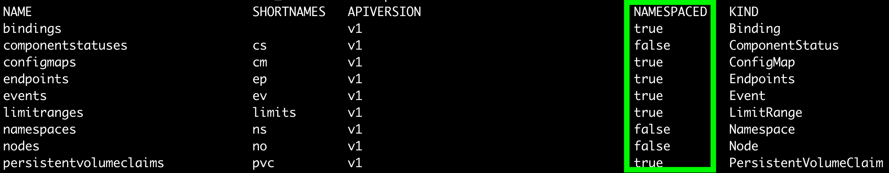

## namespace
앞에서 label에 대해서 살펴보았다. 다음과 같은 예시를 생각해보자.  
ex1) '여러 사용자가 동일한 클러스터를 사용하는데, 내가 사용한 pod name이 다른 사용자와 충돌한 경우' 
ex2) '여러 부서에서 동일한 클러스터를 사용하는데, label이 겹치는 경우'  
사용자 별, 혹은 부서 별로 독립된 환경에서 클러스터를 사용하는 것이 효율적일 것이다.  

##### namespace 조회
namespace를 조회해보면, 이미 몇 개가 생성되어 있는 것을 볼 수 있다.  
기존에 테스트로 생성한 pod들은 전부 default namespace에 생성된다.  
또한, 시스템 관련 리소스들은 전부 kube-system namespace로 생성된 것도 확인할 수 있다.

~~~sh
$ kubectl get ns                    # namespace 확인
$ kubectl get po                    # namespace를 명시하지 않으면 자동으로 default namespace로 조회한다.
$ kubectl get po -n kube-system     # 클러스터 세팅관련 pod 들은 kube-system namespace에서 조회된다.
~~~

##### namespace 생성
~~~sh
$ kubectl create ns my-namespace
~~~

##### namespace에 pod 생성하기
~~~yaml
apiVersion: v1
kind: Pod
metadata:
  name: my-namespace-pod
  namespace: my-namespace   # namespace
spec:
  containers:
  - image: luksa/kubia
    name: kubia
    ports:
    - containerPort: 8080
      protocol: TCP
~~~

~~~sh
$ kubectl get po -n my-namespace
~~~

## namespace의 범위
리소스를 사옹자 별, 혹은 부서 별로 독립되게 관리할 수 있도록 하는 기능으로 배웠다.  
하지만, 모든 리소스를 namespace로 나눌 수 있을까? 그렇지는 않다.  
단적으로 예를 들어, node도 리소스인데 이를 사용자 단위로 관리할 수는 없을 것이다.  
혹은, namespace 그 자체도 리소스이다. 이는 전역적으로 관리할 수 밖에 없을 것이다.  
어떤 리소스가 namespace로 관리할 수 있는지 여부를 조회해보자.

~~~sh
$ kubectl api-resources                     # 전체 조회
$ kubectl api-resources --namespace=true    # namespace 가능한 리소스 조회
~~~

