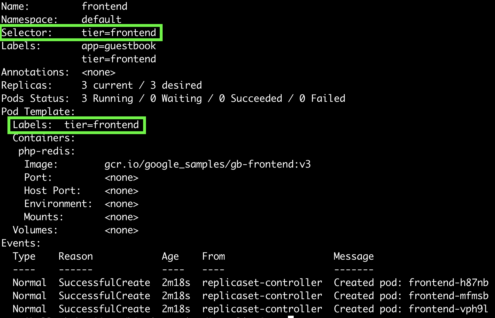
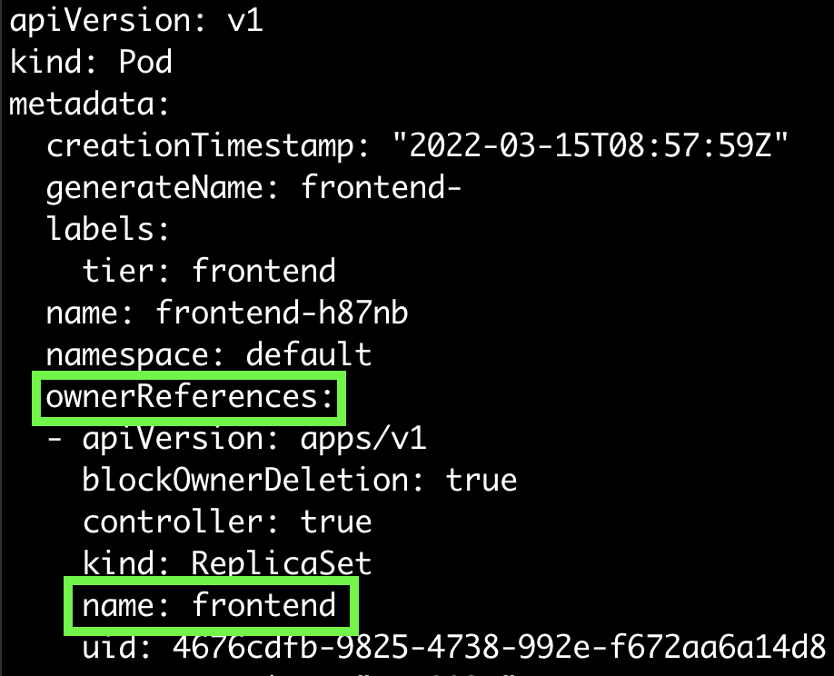

## ReplicaSet
ReplicaSet은 Pod를 어떤 환경에서도 동일한 숫자만큼 안정적으로 유지할 수 있도록 한다.  
ReplicaSet은 세 가지 필드로 정의할 수 있다. ```selector```는 ReplicaSet이 관리해야 하는 Pod의 속성을 정의한다.  
예를 들어, 어떤 label이 세팅된 Pod를 관리해야 하는 지 정의한다. ```number of replica```를 정의함으로써 Pod replica를 몇 개를 유지해야 하는 지 정의한다.    
```pod template```은 replica 생성을 위해 새로 pod를 생성해야 하는 경우, 여기에 정의된 값을 이용한다.

ReplicaSet은 Pod의 metadata.ownerReferences 필드를 통해 연결되어 있다. Pod에서 이 값을 조회함으로서 어떤 ReplicaSet에 의해 관리되고 있는 지 확인할 수 있다.  
ReplicaSet은 Pod의 ownerReferences 필드값을 읽어 새로운 pod를 생성하거나 삭제하는데에 사용한다.  

<b>ReplicaSet의 상위레벨인 Deployment를 사용하고, 왠만하면 ReplicaSet은 사용하지 않을 것을 권장한다.</b>

#### exercise
~~~yaml
apiVersion: apps/v1
kind: ReplicaSet
metadata:
  name: frontend
  labels:
    app: guestbook
    tier: frontend
spec:
  replicas: 3
  selector:
    matchLabels:
      tier: frontend
  template:
    metadata:
      labels:
        tier: frontend
    spec:
      containers:
      - name: php-redis
        image: gcr.io/google_samples/gb-frontend:v3
~~~

~~~sh
$ kubectl describe rs/frontend
~~~



#### ownerReferences 확인해보기
~~~
$ kubectl get po frontend-h87nb -o yaml
~~~




#### ReplicaSet 사용 시 주의할 점
Pod를 단독으로 생성할 때에, ReplicaSet과 동일한 label을 붙여서는 안된다. 예를 들어보자.  

ex1) ReplicaSet의 ```selector```에서 ```A``` label로 정의한 3개의 pod를 생성하고, 같은 label을 가진 Pod를 단독으로 생성한다.  
ex2) ```A``` label로 단독 Pod를 2개 생성한 뒤, ReplicaSet의 ```selector```에서 ```A``` label로 3개의 replica number를 설정한다.

ex1) 에서는 Pod 단독생성 시에, pod가 생성됨과 동시에 ReplicaSet에 감지된다. 따라서 바로 종료된다.   
ex2) 에서는 이미 ```A``` label로 2개의 pod가 있기 때문에, ReplicaSet으로 생성 시에 1개의 Pod만 생성된다.

#### ReplicaSet으로부터 Pod 제외하기
Pod의 label을 변경하면 ReplicaSet의 관리대상에서 제외되고, ReplicaSet은 Pod를 새로 생성한다.  
이러한 방법은 디버그나 장애테스트 등을 할 떄에 사용할 수 있다.

#### Scaling a ReplicaSet
ReplicaSet의 ```.spec.replicas``` 필드를 이용하여 scale up/down 할 수 있다.  
scale down 시에는 아래의 알고리즘에 따라 down 할 Pod를 선택한다.

    1. 아직 생성되지 않은 혹은 schedule 되지 않은 Pod가 있다면 이를 먼저 종료한다.
    2. ontroller.kubernetes.io/pod-deletion-cost 어노테이션이 붙어있다면, 더 낮은 값이 세팅된 Pod를 종료한다. 
    3. replica Pod를 많이 가진 순서로 종료한다. 
    4. 최근에 생성된 순서대로 종료한다.

#### Alternatives to ReplicaSet

- Deployment
- Job
- DaemonSet

## Reference
- https://kubernetes.io/docs/concepts/workloads/controllers/replicaset/
