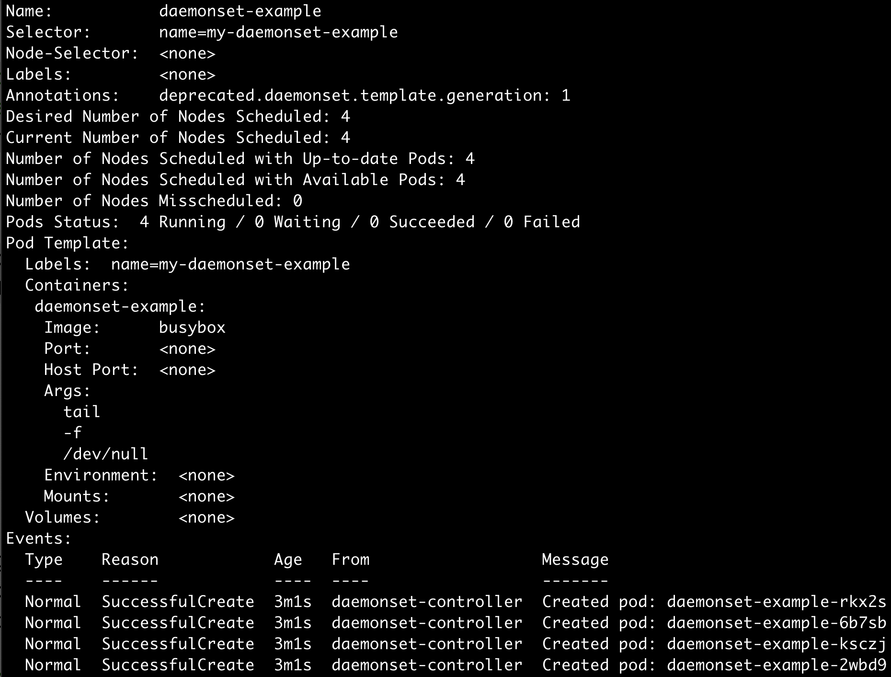
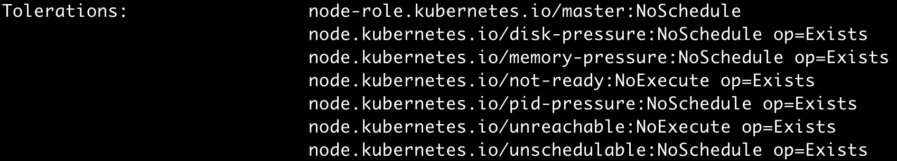

## DaemonSet
DaemonSet은 모든 (혹은 일부) node에서 Pod 가 실행될 수 있도록 보장한다.   
클러스터에 node가 추가/삭제되면, Pod도 같이 추가/삭제된다.   
DaemonSet을 삭제한다면, DaemonSet이 생성한 모든 Pod를 같이 제거한다.

클러스터 스토리지, 로그 수집, 모니터링 등의 daemon을 실행할 필요가 있을때에 유용하다.

#### exercise
~~~yaml
apiVersion: apps/v1
kind: DaemonSet
metadata:
  name: daemonset-example
spec:
  selector:
    matchLabels:
      name: my-daemonset-example
  template:
    metadata:
      labels:
        name: my-daemonset-example
    spec:
      tolerations:
      - key: node-role.kubernetes.io/master
        effect: NoSchedule
      containers:
      - name: daemonset-example
        image: busybox
        args: ["tail", "-f", "/dev/null"]
~~~

~~~
kubectl describe ds daemonset-example
~~~

#### DaemonSet 으로 생성한 Pod는 무엇이 다를까?
위의 예제로 생성된 Pod 를 살펴보자.  
DaemonSet으로 생성한 Pod 여러 toleration 들이 자동으로 추가된다.

  
이러한 설정들은, 예를 들어 node가 network partition 등으로 NotReady, UnReachable 상태일 때에 Pod를 evict 하지 않도록 한다.    
혹은 node가 disk, memory 부족 등의 상태로 NoSchedule taint가 세팅되어 있을때에도 Pod를 해당 node에 schedule 될 수 있도록 한다.

#### kubernetes로 daemon을 실행하면 어떤 것이 좋을까?
node 별로 daemon을 굳이 컨테이너로 띄우지 않고, OS에서 지원하는 daemon으로 띄울 수도 있을 것이다.  
예를 들어, init, upstartd, systemd 와 같이 익숙한 daemon들이 있다.  

하지만, DaemonSet을 이용하여 컨테이너로 띄운다면 아래와 같은 이점을 얻을 수 있다.

- 어플리케이션을 다루는 것과 동일하게 다룰 수 있기 때문에 관리가 쉽다.
- kubernetes 리소스로 daemon을 다루기 때문에, kubernetes의 여러 명령어들을 이용할 수 있다.
- 컨테이너로 띄운다면 다른 어플리케이션들과 분리하여 자원(cpu, memory 등)을 할당할 수 있다.  

## Reference
- https://kubernetes.io/ko/docs/concepts/workloads/controllers/daemonset/