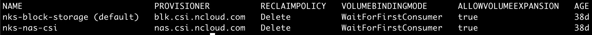

## StorageClass
먼저 kubernetes volume, persistent volume 등에 익숙할 필요가 있다.  

StorageClass는 kubernetes 관리자가 제공하는 스토리지의 유형들을 기술한다.  
SSD/HDD 인지, pvc가 삭제될 때에 데이터가 보관되어야 하는 지, pvc가 언제 생성되는 지, 볼륨확장은 가능한 지 등의 스토리지 profile을 구성한다.  
관리자가 제공하는 여러 StorageClass 들을 조회하고, Pod 생성시에 StorageClass를 명시하면 조건에 맞는 스토리지가 할당된다.
  
## example (ncloud)

`kubernetes 관리자`의 입장에서 아래의 StorageClass를 미리 등록해둘 수 있다. 

~~~
$ kubectl get sc
~~~

~~~
$ kubectl get sc nks-block-storage -o yaml
~~~

~~~yaml
kind: StorageClass
apiVersion: storage.k8s.io/v1
metadata:
  name: nks-block-storage
  namespace: kube-system
  annotations:
    storageclass.kubernetes.io/is-default-class: "true" # StorageClass의 경우 default 여부를 세팅할 수 있다. pvc에서 별도의 StorageClass를 명시하지 않으면 default StorageClass가 선택된다.
provisioner: blk.csi.ncloud.com
volumeBindingMode: WaitForFirstConsumer # Pod가 생성되는 시점에 pvc가 생성된다. 다른 옵션으로는 Immediate 가 가능하며, pvc가 생성되는 시점에 생성된다.
reclaimPolicy: Delete # pvc가 삭제될 때에 데이터를 유지할지 여부이다. 다른 옵션으로 Retain이 가능하다.
allowVolumeExpansion: true # 볼륨확장 가능여부이다.
parameters:
  type: SSD
~~~

`어플리케이션 개발자`로서 아래의 정보만으로 스토리지를 생성요청할 수 있다. 

~~~yaml
apiVersion: v1
kind: PersistentVolumeClaim
metadata:
  name: my-pvc
spec:
  accessModes:
  - ReadWriteOnce
  resources:
    requests:
      storage: 10Gi
  storageClassName: nks-block-storage # storageClassName을 명시하여 StorageClass를 지정한다.
---
kind: Pod
apiVersion: v1
metadata:
  name: my-pod
spec:
  containers:
    - name: my-pod
      image: outgrow0905/hostname
      volumeMounts:
      - mountPath: "/data"
        name: my-volume
  volumes:
    - name: my-volume
      persistentVolumeClaim:
        claimName: my-pvc
~~~