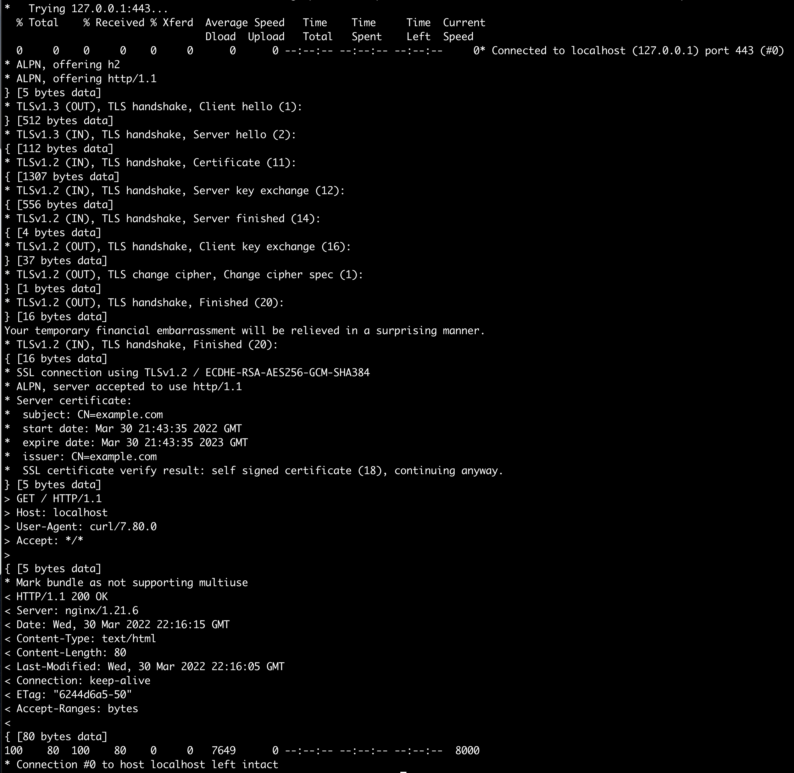

## Secret
Secret은 ConfigMap과 달리 암호, 토큰, 키와 같은 민감한 정보를 저장하는데에 사용된다.  
Secret은 Pod가 실행중인 노드에만 Secret을 배포하고, 해당 노드의 메모리에만 저장하고 물리저장소에는 저장하지 않는다.  
예전에는 마스터노드의 etcd에 Secret이 암호화되지 않은채로 저장되었으나, 1.7 이후버전부터는 암호화된 형태로 저장하도록 개선되었다.

#### example
nginx 컨테이너에 인증서정보를 Secret으로 mount하여 SSL 통신을 지원하도록 해보자.

~~~
$ openssl genrsa -out https.key 2048
$ openssl req -new -newkey rsa:4096 -days 365 -nodes -x509 -subj "/CN=example.com" -keyout https.key -out https.crt
$ echo bar > foo
$ kubectl create secret generic fortune-https --from-file=https.key --from-file=https.crt --from-file=foo
~~~

~~~
$ vi my-nginx-config.conf

server {
  listen                80;
  listen                443 ssl;
  server_name           example.com;
  ssl_certificate       certs/https.crt; # /etc/nginx 를 기준으로 한다.
  ssl_certificate_key   certs/https.key;
  ssl_protocols         TLSv1 TLSv1.1 TLSv1.2;
  ssl_ciphers           HIGH:!aNULL:!MD5;

  gzip  on;
  gzip_types text/plain application/xml;

  location / {
    root    /usr/share/nginx/html;
    index   index.html index.html;
  }
}

$ kubectl create configmap fortune-config-https --from-file=my-nginx-config.conf
~~~

~~~
$ vi fortune-https.yaml
~~~
~~~yaml
apiVersion: v1
kind: Pod
metadata:
  name: fortune
  labels:
    name: fortune
spec:
  containers:
  - image: outgrow0905/fortune:env
    env:
    - name: INTERVAL
      valueFrom:
        configMapKeyRef:
          name: fortune-config-https
          key: sleep-interval
    name: html-generator
    volumeMounts:
    - name: html
      mountPath: /var/htdocs
  - image: nginx:alpine
    name: web-server
    volumeMounts:
    - name: html
      mountPath: /usr/share/nginx/html
      readOnly: true
    - name: config
      mountPath: /etc/nginx/conf.d
      readOnly: true
    - name: certs # secret volume
      mountPath: /etc/nginx/certs/ # nginx config에서 설정한 인증서 경로
      readOnly: true
    ports:
    - containerPort: 80
      protocol: TCP
    - containerPort: 443 # https port
      protocol: TCP
  volumes:
  - name: html
    emptyDir: {}
  - name: config
    configMap:
      name: fortune-config-https
  - name: certs # secret volume
    secret:
      secretName: fortune-https
~~~

~~~
$ kubectl exec fortune -c web-server -- curl https://localhost:443 -k -v
~~~

## Reference
- https://kubernetes.io/docs/concepts/configuration/secret/