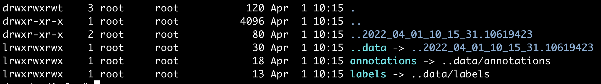
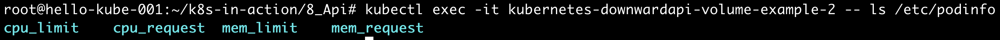

## Downward API
Pod 자체의 메타데이터 혹은 Pod 에 속한 특정 컨테이너의 메타데이터를 실행중인 프로세스에 노출할 용도로 쓰인다.  
예를 들어, 특정 변수들을 이미 알고 있을 경우 Pod가 생성하는 시점에 전달하는 방법은 많다.  
하지만, 미리 알고있을 수 없는 Pod의 이름이나 label을 프로세스로 전달하려면 어떻게 해야할까?  

Downward API를 이용해보자.

## Pod의 메타데이터 저장하기
~~~yaml
apiVersion: v1
kind: Pod
metadata:
  name: kubernetes-downwardapi-volume-example
  labels:
    zone: seoul
    cluster: seoul-cluster-1
    rack: rack-22
  annotations:
    build: two
    builder: outgrow0905
spec:
  containers:
    - name: client-container
      image: busybox
      command: ["sh", "-c"]
      args:
      - while true; do
          if [[ -e /etc/podinfo/labels ]]; then
            echo -en '\n\n'; cat /etc/podinfo/labels; fi;
          if [[ -e /etc/podinfo/annotations ]]; then
            echo -en '\n\n'; cat /etc/podinfo/annotations; fi;
          sleep 5;
        done;
      volumeMounts:
        - name: podinfo
          mountPath: /etc/podinfo
  volumes:
    - name: podinfo
      downwardAPI:
        items:
          - path: "labels"
            fieldRef:
              fieldPath: metadata.labels
          - path: "annotations"
            fieldRef:
              fieldPath: metadata.annotations
~~~

/etc/podinfo 경로에 volume이 생성된 것을 볼 수 있다.

~~~
$ kubectl exec -it kubernetes-downwardapi-volume-example -- /bin/sh
$ cat /etc/podinfo/labels
  rack="rack-22"
  zone="seoul"
$ ls /etc/podinfo -al
~~~

아래 캡쳐를 보면, `..data`가 `labels`와 `annotation`에 symbolic link로 걸려있는 것을 알 수 있다.
이는 다른 volume들과 마찬가지로 해당정보가 변경되면 실시간으로 반영되어 update 된다.

## 컨테이너의  메타데이터 저장하기
Pod에 여러 컨테이너가 포함되어있다고 가정하면,
각 컨테이너의 정보들을 전달할 필요가 있을 수도 있을 것이다. 아래와 같이 사용하면 된다. 

~~~
apiVersion: v1
kind: Pod
metadata:
  name: kubernetes-downwardapi-volume-example-2
spec:
  containers:
    - name: client-container
      image: k8s.gcr.io/busybox:1.24
      command: ["sh", "-c"]
      args:
      - while true; do
          echo -en '\n';
          if [[ -e /etc/podinfo/cpu_limit ]]; then
            echo -en '\n'; cat /etc/podinfo/cpu_limit; fi;
          if [[ -e /etc/podinfo/cpu_request ]]; then
            echo -en '\n'; cat /etc/podinfo/cpu_request; fi;
          if [[ -e /etc/podinfo/mem_limit ]]; then
            echo -en '\n'; cat /etc/podinfo/mem_limit; fi;
          if [[ -e /etc/podinfo/mem_request ]]; then
            echo -en '\n'; cat /etc/podinfo/mem_request; fi;
          sleep 5;
        done;
      resources:
        requests:
          memory: "32Mi"
          cpu: "125m"
        limits:
          memory: "64Mi"
          cpu: "250m"
      volumeMounts:
        - name: podinfo
          mountPath: /etc/podinfo
  volumes:
    - name: podinfo
      downwardAPI:
        items:
          - path: "cpu_limit"
            resourceFieldRef:
              containerName: client-container
              resource: limits.cpu
              divisor: 1m
          - path: "cpu_request"
            resourceFieldRef:
              containerName: client-container
              resource: requests.cpu
              divisor: 1m
          - path: "mem_limit"
            resourceFieldRef:
              containerName: client-container
              resource: limits.memory
              divisor: 1Mi
          - path: "mem_request"
            resourceFieldRef:
              containerName: client-container
              resource: requests.memory
              divisor: 1Mi
~~~

~~~
$ kubectl exec -it kubernetes-downwardapi-volume-example-2 -- ls /etc/podinfo
~~~

## Reference
- https://kubernetes.io/docs/tasks/inject-data-application/downward-api-volume-expose-pod-information/