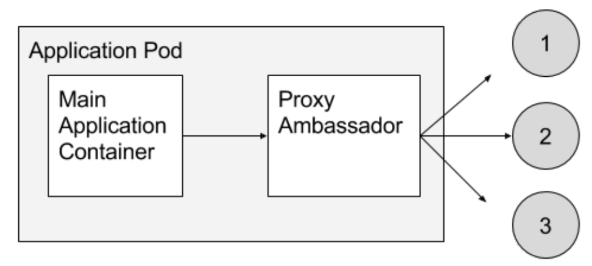
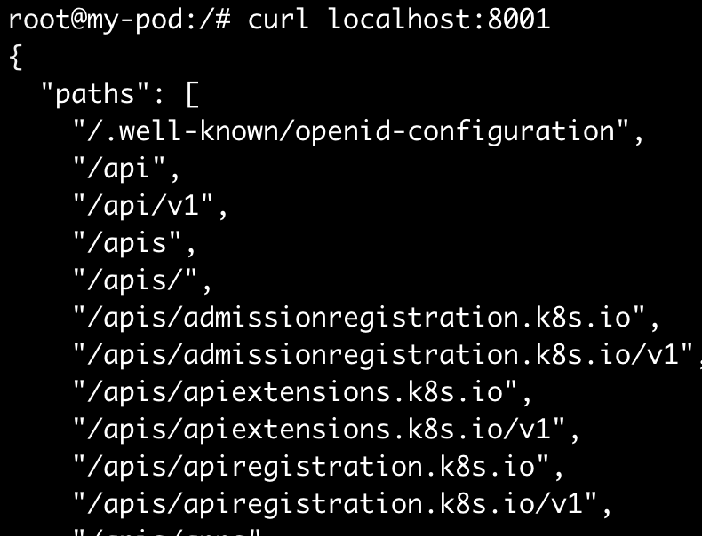

## Ambassador Pattern
실제 서비스를 구성한다고 가정하였을 때, kubernetes API에 접근할때마다 인증하고 질의하는 것은 여간 귀찮은 일이 아니다.  
kubernetes proxy를 기억하는가? proxy sidecar를 띄워서 통신전용 컨테이너를 띄워보자.

## example
#### 스크립트 생성
먼저, kubernetes proxy를 띄우는 스크립트를 생성한다.    
스크립트를 보면 알겠지만, `kubectl`이 먼저 설치된 이미지에서 정상작동 할 것이다.
~~~
#!/bin/sh

API_SERVER="https://$KUBERNETES_SERVICE_HOST:$KUBERNETES_SERVICE_PORT"
CA_CRT="/var/run/secrets/kubernetes.io/serviceaccount/ca.crt"
TOKEN="$(cat /var/run/secrets/kubernetes.io/serviceaccount/token)"

/kubectl proxy --server="$API_SERVER" --certificate-authority="$CA_CRT" --token="$TOKEN" --accept-paths='^.*'
~~~

#### DockerFile
위에 생성한 스크립트를 수행하는 Dockerfile을 생성한다.
~~~
FROM ubuntu:latest
RUN apt-get update && apt-get -y install curl && curl -L -O https://dl.k8s.io/v1.8.0/kubernetes-client-linux-amd64.tar.gz && tar zvxf kubernetes-client-linux-amd64.tar.gz kubernetes/client/bin/kubectl && mv kubernetes/client/bin/kubectl / && rm -rf kubernetes && rm -f kubernetes-client-linux-amd64.tar.gz
ADD kubectl-proxy.sh /kubectl-proxy.sh
ENTRYPOINT ["/kubectl-proxy.sh"]
~~~

~~~
$ docker build -t outgrow0905/kubectl-proxy .
$ docker push outgrow0905/kubectl-proxy
~~~

#### kubernetes Pod의 sidecar로 실행
~~~yaml
apiVersion: v1
kind: Pod
metadata:
  name: my-pod
spec:
  containers:
  - image: outgrow0905/hostname
    name: my-container
  - image: outgrow0905/kubectl-proxy
    name: my-proxy
~~~
~~~
$ kubectl exec -it my-pod -c my-container -- /bin/bash
$ root@my-pod:/# netstat -tnlp | grep 8001
$ root@my-pod:/# curl localhost:8001
~~~
