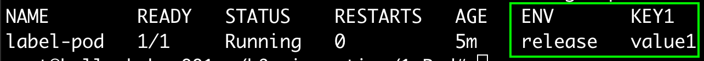
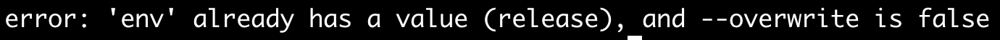
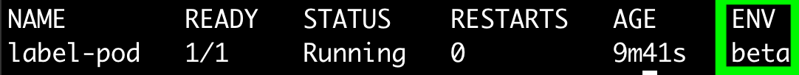
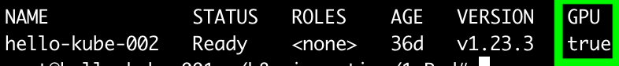
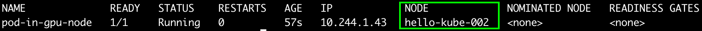

## label
label은 Pod를 포함한 다른 쿠버네티스 리소스들을 조직화하고 관리할 수 있는 강력한 기능이다.  
label은 리소스에 부여하는 key-value 로써, 이를 참조하여 label selector가 동작한다.  
일반적으로는 리소스 생성 시 label을 부여하지만, 생성된 이후에도 변경하거나 부여할 수 있다.  

 ~~~yaml
 apiVersion: v1
 kind: Pod
 metadata:
   name: label-pod
   labels: # 여러개의 label을 부여할 수 있다.
     env: release
     key1: value1
     key2: value2
 spec:
   containers:
   - image: luksa/kubia
     name: kubia
     ports:
     - containerPort: 8080
       protocol: TCP
 ~~~
 
 #### label 전부 조회하기
 ~~~sh
 $ kubectl get po --show-labels
 ~~~
 
 
 
 #### 특정 label 조회하기
~~~sh
$ kubectl get po -L env,key1
~~~

#### 생성된 pod의 label 수정
기존에 이미 같은 label key로 설정이 되어있는 경우, 이를 자동으로 덮어쓰지 않는다.

~~~sh
$ kubectl label po label-pod env=beta
~~~

#### 생성된 Pod의 label overwrite
~~~sh
$ kubectl label po label-pod env=beta --overwrite
~~~

~~~sh
$ kubectl get po -L env
~~~

#### label selector를 사용한 Pod 조회
~~~sh
$ kubectl get po -l env=release                     # env=release 인 조건을 검색
$ kubectl get po -l env=release,key1=value1         # env=release 이고, key1=value1 인 조건을 검색
$ kubectl get po -l env                             # env label이 세팅된 Pod 전부 조회
$ kubectl get po -l '!env                           # env label이 세팅된 Pod 제외 전부 조회
~~~

## 다른 리소스에서의 label
label은 Pod에만 설정할 수 있는 것이 아니다. k8s 오브젝트에는 대부분 부여할 수 있다.  
예를 들어, node에도 부여하여 특정 조건(label)의 node에서 Pod가 생성되도록 할 수 있다.

#### node label 조회
아래 명령어를 수행하면, 이미 많은 label 들이 기본적으로 설정되어 있는 것을 알 수 있다.  
주목해야 할 label중 히나는 'kubernetes.io/hostname'이다. 이는 각 node 별로 host 명에 따라 고유하게 설정된다.  
이 값을 이용하여, 모든 node에 Pod를 하나씩 배치할 수도 있고, 반대로 특정 node에 Pod를 설치할 수도 있다.

또한, master에는 추가로 더 많은 label 들이 설정되어 있는데, 이 설정들을 잘 이용한다면, master node에만 특정 Pod를 배치하거나,  
일반적인 pod 는 생성되지 않도록 설정할 수 있다.

~~~
kubectl get node --show-labels
~~~

#### node label 설정
~~~
$ kubectl label node hello-kube-002 gpu=true
$ kubectl get node -l gpu=true -L gpu
~~~

#### gpu label 이 설정된 node에 Pod 생성하기
~~~yaml
apiVersion: v1
kind: Pod
metadata:
  name: pod-in-gpu-node
spec:
  nodeSelector:
    gpu: "true"
  containers:
  - image: luksa/kubia
    name: kubia
    ports:
    - containerPort: 8080
      protocol: TCP
~~~

~~~sh
$ kubectl get po pod-in-gpu-node -o wide
~~~

#### label 사용하여 pod 정리하기
~~~sh
$ kubectl delete po -l env  # env label이 있는 Pod 전부 삭제
$ kubectl delete po --all   # Pod 전부 삭제
~~~