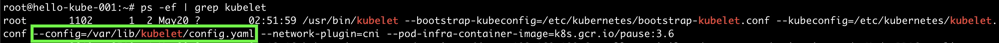
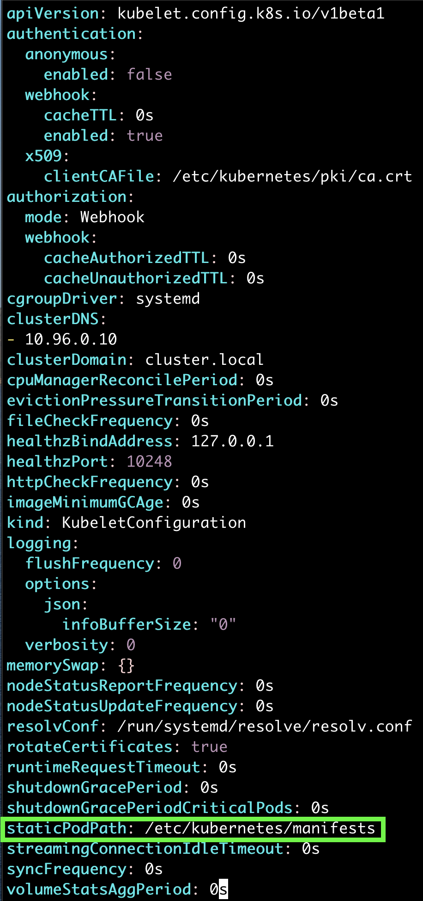
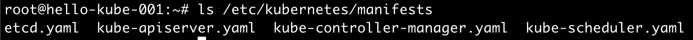

## static Pod
우리는 손쉽게 `kubeadm` 툴을 통해 클러스터를 구축하였다.
하지만, 궁금하지 않은가? 
마스터 노드에 생성되는 `etcd`, `api-server`, `kube-controller-manager`, `scheduler` Pod는 어떻게 자동으로 생성되었을까?

[setup](../0_Setup/0_1_setup.md)에서 잠시 봤지만, 위의 4가지 관리 Pod의 설정이 `/etc/kubernetes/manifests`에 들어있다.
저기 들어있는 것은 알려줘서 알겠는데, 저기 들어있다고 Pod가 생성될리는 없지 않은가?

생성된다. 어떻게?  

노드에서 Pod를 띄우는 것은 kubelet이니 마스터 노드에서 kubelet 프로세스를 살펴보자.

~~~
$ ps -ef | grep kubelet
~~~

kubelet 설정파일이 저기 경로에 있는 것 같다. 파일을 실제로 살펴보자.

`staticPodPath`가 보인다. 여기에 있는 파일들은 아묻따 Pod를 생성하는 것이다.
저 path를 실제로 살펴보면, 클러스터 관리 Pod 4가지의 설정파일이 들어있다.

여기서 끝낼 것인가? 검증을 해보자.
다른 워커 노드에 접속하여, static Pod를 생성해보자.

## example
 

## Reference
- https://kubernetes.io/docs/tasks/configure-pod-container/static-pod/