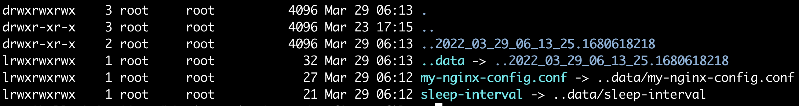

## ConfigMap
ConfigMap은 (기밀이 아닌) 일반 데이터를 key-value 형태로 저장하는 객체이다.  
Pod는 ConfigMap을 환경변수, 커맨드라인 인수, 혹은 volume에 저장하여 Pod에 파일형태로 사용할 수도 있다.  

ConfigMap의 목적은 환경정보들과 컨테이너 이미지를 decouple 하는 것이 목적이다.  
예를 들어, 데이터베이스 접속정보를 코드에 저장한다면, 환경별로 다른 이미지를 만들어야 할 것이다.

ConfigMap 자체는 애초에 큰 데이터를 저장하기 위한 목적이 아니다. 따라서 1MiB를 넘게 저장하지도 못한다.    
그 이상의 데이터를 저장해야한다면, volume을 사용하거나 다른 서비스를 이용해야 한다.

Pod에서 ConfigMap을 사용하는 네 가지 방식이 있다.

    1. 컨테이너 내부 명령어와 인자로 사용할 수 있다. 
    2. 컨테이너의 환경변수로 사용할 수 있다.
    3. read-only volume에 ConfigMap을 저장하여 어플리케이션이 읽을 수 있도록 할 수 있다.
    4. Pod 내부의 어플리케이션 코드에서 kubernetes API를 이용해서 ConfigMap을 읽어서 사용할 수 있다.

1~3번은 Pod가 생성될 때애 kubelet이 ConfigMap 값들을 이용할 수 있다.    
4번은 어플리케이션에서 ConfigMap을 읽는 코드를 작성해야만 한다. 이렇게 사용하면, ConfigMap이 변경될때마다 실시간으로 어플리케이션이 이를 반영하게 된다.  
이를 반드시 숙지하고 개발해야 할 것이다.  
API를 통한 ConfigMap 접근의 장점 중 하나는 다른 namespace의 ConfigMap에도 접근할 수 있다는 부분이다. 

#### Pod와 Secret
이미 우리는 인지하지 못한 채 Secret을 사용하고 있었다. Pod 생성시에 Secret을 사용하고 있었기 때문이다.    
Pod는 kubernetes api server와 통신하기 위해 Secret을 포함해야 한다.

생성된 임의의 Pod를 살펴보자.   
Pod 생성시에 `kube-root-ca.crt` 가 `/var/run/secrets/kubernetes.io/serviceaccount`애 mount 되고 있었다.

~~~
$ kubectl describe po my-pod

...
Containers:
  my-pod:
    Mounts:
      /var/run/secrets/kubernetes.io/serviceaccount from kube-api-access-jjglb (ro)
...
Volumes:
  kube-api-access-jjglb:
    Type:                    Projected (a volume that contains injected data from multiple sources)
    TokenExpirationSeconds:  3607
    ConfigMapName:           kube-root-ca.crt
...

$ kubectl exec my-pod -- ls /var/run/secrets/kubernetes.io/serviceaccount
ca.crt
namespace
token
~~~

#### example
#### cmd로 ConfigMap 생성
~~~
$ kubectl create configmap fortune-config --from-literal=sleep-interval=25 
$ kubectl get configmap fortune-config -o yaml
~~~
~~~yaml
apiVersion: v1
data:
  sleep-interval: "25" # key-value 형태로 저장된다
kind: ConfigMap
metadata:
  name: fortune-config
~~~

#### 파일로부터 configmap 생성
~~~
$ vi fortune-config.conf
sleep-interval=25
key1=value1
key2=value2

$ kubectl create configmap my-config --from-file=fortune-config.conf
$ kubectl get configmap my-config -o yaml
~~~
~~~yaml
apiVersion: v1
data:
  fortune-config.conf: |
    sleep-interval=25
    key1=value1
    key2=value2
kind: ConfigMap
metadata:
  name: my-config
~~~

#### 특정디렉토리 파일 전부 configmap 생성
~~~
$ kubectl create configmap my-config --from-file=./
~~~

## Pod의 환경변수로 ConfigMap 전달하기
#### ConfigMap 특정 데이터 전달
~~~
$ kubectl create configmap fortune-config --from-literal=sleep-interval=25 
~~~
~~~yaml
apiVersion: v1
kind: Pod
metadata:
  name: fortune
  labels:
    name: fortune
spec:
  containers:
  - image: outgrow0905/fortune:env
    env:
    - name: INTERVAL
      valueFrom:
        configMapKeyRef:
          name: fortune-config # configmap 이름
          key: sleep-interval  # configmap 안에 들어있는 변수명
    name: html-generator
    volumeMounts:
    - name: html
      mountPath: /var/htdocs
  - image: nginx:alpine
    name: web-server
    volumeMounts:
    - name: html
      mountPath: /usr/share/nginx/html
      readOnly: true
    ports:
    - containerPort: 80
      protocol: TCP
  volumes:
  - name: html
    emptyDir: {}
~~~
#### ConfigMap 전체 데이터 전달
~~~yaml
...
envFrom:
- prefix: CONFIG_
  configMapRef:
    name: my-config-map
...
~~~

#### 명령줄 인자로 전달
~~~yaml
env:
- name: INTERVAL
  valueFrom:
    configMapKeyRef:
      name: fortune-config 
      key: sleep-interval  
args: ["$(INTERVAL)"]
~~~

## volume 사용하여 전달하기
~~~
$ mkdir configmap-files
$ cd configmap-files
$ vi my-nginx-config.conf

server {
  listen            80;
  server_name       www.outgrow0905.com;
  
  gzip  on;
  gzip_types text/plain application/xml;
  
  location / {
    root    /usr/share/nginx/html;
    index   index.html index.htm;
  }
}

$ echo 25 > sleep-interval
$ kubectl create configmap my-config --from-file=configmap-files
$ ls
  my-nginx-config.conf  sleep-interval
$ kubectl create configmap fortune-config --from-file=configmap-files
~~~
~~~yaml
apiVersion: v1
kind: Pod
metadata:
  name: fortune
  labels:
    name: fortune
spec:
  containers:
  - image: outgrow0905/fortune:env
    env:
    - name: INTERVAL
      valueFrom:
        configMapKeyRef:
          name: fortune-config
          key: sleep-interval
    name: html-generator
    volumeMounts:
    - name: html
      mountPath: /var/htdocs
  - image: nginx:alpine
    name: web-server
    volumeMounts:
    - name: html
      mountPath: /usr/share/nginx/html
      readOnly: true
    - name: config                  
      mountPath: /etc/nginx/conf.d  # configmap 을 mount할 경로이다. nginx가 설정값을 읽어들이는 기본경로이다.
      readOnly: true                # 읽기전용으로만 가능하다
    ports:
    - containerPort: 80
      protocol: TCP
  volumes:
  - name: html
    emptyDir: {}
  - name: config                  # configmap을 volume으로 mount하기
    configMap:
      name: fortune-config
~~~

~~~
$ kubectl exec -it fortune -c web-server -- ls /etc/nginx/conf.d
  my-nginx-config.conf  sleep-interval
$ kubectl exec -it fortune -c web-server -- curl -H "Accept-Encoding: gzip" -I localhost:80
  Content-Encoding: gzip
~~~

#### 주의할 점
위 예시에서 web-server 컨테이너의 `/etc/nginx/conf.d` 디렉토리는 configmap을 mount하면서 초기화된다.    
기존의 파일들이 있었다면 전부 제거된다는 의미이다. 만약 `/etc` 디렉토리로 mount를 했다면 컨테이너가 손상되었을 것이다.    
이러한 문제를 방지하기 위해서 `subPath` 속성을 이용할 수 있다. 

~~~yaml
- name: config
  mountPath: /etc/nginx/conf.d/my-nginx-config.conf
  subPath: my-nginx-config.conf
  readOnly: true
~~~

아래 명령어를 통해 원래 있었던 default.conf 파일이 그대로 남아있는 것을 알 수 있다.
~~~
$ kubectl exec -it fortune -c web-server -- ls /etc/nginx/conf.d
  default.conf          my-nginx-config.conf
~~~

## ConfigMap 변경과 실시간 반영
kubelet은 일정주기마다 ConfigMap이 변경되는지 확인한다.    
변경사항이 있다면 이를 mount 한 모든 ConfigMap을 변경한다.  

하지만, kubelet은 refresh된 ConfigMap을 읽지 않고, local cache를 읽어들이기 때문에 변경사항이 실행중인 프로세스에 반영되지는 않는다.   
local cache의 방식은 [KubeletConfiguration](https://kubernetes.io/docs/reference/config-api/kubelet-config.v1beta1/)의 `ConfigMapAndSecretChangeDetectionStrategy` 값을 통해 변경할 수 있다. 

~~~
$ kubectl exec -it fortune -c web-server -- curl -H "Accept-Encoding: gzip" -I localhost:80
  Content-Encoding: gzip
$ kubectl edit configmap fortune-config
  gzip  off; # 변경한다.
$ kubectl exec -it fortune -c web-server -- cat /etc/nginx/conf.d/my-nginx-config.conf
  gzip  off; 변경분을 확인할 수 있다.
~~~

configmap 이 변경되었지만 프로세스에 이를 반영하는 것은 별개이다.

~~~
$ kubectl exec -it fortune -c web-server -- nginx -s reload
~~~

#### ConfigMap이 모니터링되고 변경되는 과정 이해하기
아래의 명령어를 실행해보면 mount한 ConfigMap 파일들이 전부  `../data`로 symbolic link로 걸려있는 것을 알 수 있다.  
ConfigMap이 변경이 되면 kubernetes는 이를 감지하고, 미리 새 디렉토리를 생성한 후에 symbolic link만 새로운 디렉토리를 가리키도록 변경한다.

~~~
$ kubectl exec -it fortune -c web-server -- ls /etc/nginx/conf.d -al
~~~

#### 주의할 점
디렉토리 전체를 ConfigMap 으로 mount하지 않고, 일부만 한 경우에는 ConfigMap 변경이 반영되지 않는다.  
예를 들어, `subPath` 를 사용한 경우에는 ConfigMap 변경이 반영되지 않는다.  
이를 반영할 수 있는 한가지 우회방법은 전체 ConfigMap을 특정 디렉토리에 전부 mount한 뒤, 사용해야 하는 파일만 symbolic link를 통해 참조하도록 하는 것이다. 

## Immutable ConfigMaps
ConfigMap(or Secret)은 `immutable` 옵션을 사용할 수 있다.    
이 옵션을 사용하면 api-server 의 모니터링 대상으로부터 제외된다. 변경되더라도 반영되지 않는다는 의미이다.  
오로지 삭제하거나 재생성하는 방법만이 가능하게 된다.

수만개 이상 ConfigMap을 사용하는 클러스터의 경우는 `immutable` 속성을 통해 아래와 같은 이점을 얻을 수 있다.

- 실수로 변경되었을 때에 어플리케이션에 반영되는 것을 방지할 수 있다.
- kube-apiserver가 `immutable` ConfigMap을 모니터링하지 않도록 함으로서, 클러스터의 성능을 향상시킬 수 있다.

## Reference
- https://kubernetes.io/docs/concepts/configuration/configmap/