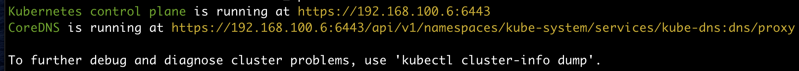

## Kubernetes API
이전에 Downward API를 통해서 Pod나 컨테이너의 메타데이터를 프로세스에 전달하는 방법을 확인했다.  
하지만, 다른 Pod나 Service에 대한 정보가 필요하다면 어떻게 이용할 수 있을까?  

Kubernetes API를 이용해보자.

## Proxy
~~~
$ kubectl cluster-info
~~~

호출해도 인증에 성공하지 못한다.
~~~
$ curl https://192.168.100.6:6443 -k

 {
   "kind": "Status",
   "apiVersion": "v1",
   "metadata": {},
   "status": "Failure",
   "message": "forbidden: User \"system:anonymous\" cannot get path \"/\"",
   "reason": "Forbidden",
   "details": {},
   "code": 403
 }
~~~

proxy로 테스트한다.
~~~
$ kubectl proxy
$ curl localhost:8001

{
  "paths": [
    "/.well-known/openid-configuration",
    "/api",
    "/api/v1",
    "/apis",
    "/apis/"
    ...
}
~~~

## Pod 내에서 API 서버와 통신
Pod 내부에서 API 서버와 통신하려면 다음의 3가지를 처리해야 한다.

- API 서버의 위치를 알아야 한다.
- API 서버가 내가 통신하려는 API 서버가 맞는지 인증히야 한다. (브라우저가 CA를 통해 서버를 인증하는 것과 동일하다.)
- API 서버도 내가 정상적인 클라이언트라는 것을 인증해야 한다.

#### API 서버위치 찾기
일단 일반적인 Pod를 생성해보자.

~~~yaml
apiVersion: v1
kind: Pod
metadata:
  name: my-pod
spec:
  containers:
  - image: outgrow0905/hostname
    name: my-pod
~~~
~~~
$ kubectl exec -it my-pod -- /bin/bash
$ root@my-pod:/# env | grep KUBERNETES
  KUBERNETES_PORT_443_TCP_PORT=443
  KUBERNETES_PORT=tcp://10.96.0.1:443
  KUBERNETES_SERVICE_PORT=443
  KUBERNETES_SERVICE_HOST=10.96.0.1
  KUBERNETES_PORT_443_TCP_PROTO=tcp
  KUBERNETES_SERVICE_PORT_HTTPS=443
  KUBERNETES_PORT_443_TCP_ADDR=10.96.0.1
  KUBERNETES_PORT_443_TCP=tcp://10.96.0.1:443
~~~

#### API 서버 인증하기
~~~
$ root@my-pod:/# curl https://kubernetes
  curl: (60) SSL certificate problem: unable to get local issuer certificate
  ...
$ root@my-pod:/# curl --cacert /var/run/secrets/kubernetes.io/serviceaccount/ca.crt https://kubernetes
  {
    "kind": "Status",
    "apiVersion": "v1",
    "metadata": {},
    "status": "Failure",
    "message": "forbidden: User \"system:anonymous\" cannot get path \"/\"",
    "reason": "Forbidden",
    "details": {},
    "code": 403
  }
$ root@my-pod:/# export CURL_CA_BUNDLE=/var/run/secrets/kubernetes.io/serviceaccount/ca.crt
~~~

#### 클라이언트 인증하기
~~~
$ root@my-pod:/# export TOKEN=$(cat /var/run/secrets/kubernetes.io/serviceaccount/token)
$ root@my-pod:/# curl -H "Authorization: Bearer $TOKEN" https://kubernetes
~~~
혹시 안된다면:q
~~~
$ kubectl create clusterrolebinding permissive-binding --clusterrole=cluster-admin --group=system:serviceaccounts
~~~