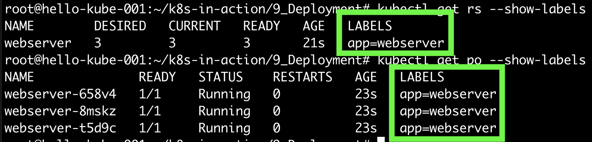
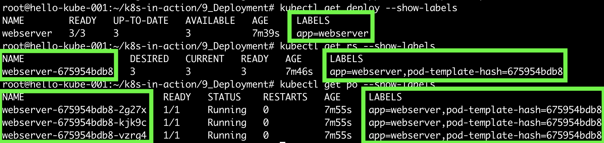
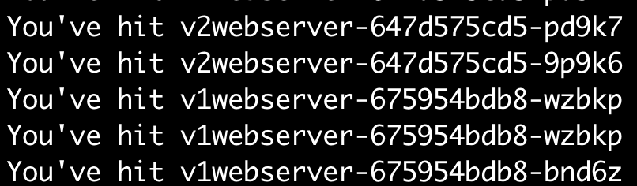
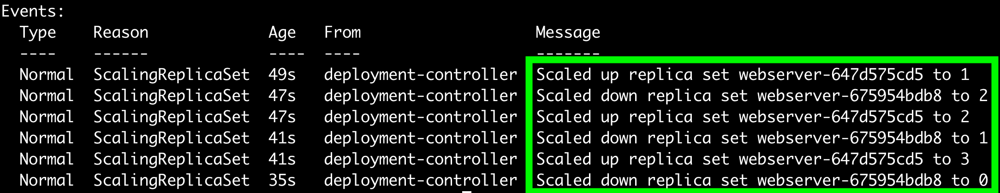
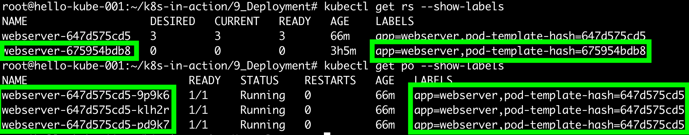

## Deployment
ReplicaSet 대신에 Deployment를 사용해야 하는 이유는 무엇일까?  
ReplicaSet으로는 이미지 변경이나 버전관리가 안되기 때문일까?  
안된다. 정확하게는 되었다가 지금은 지원하지 않는다. 더이상 알아보지 말자.

## ReplicaSet 으로 생성한 Pod와 Deployment로 생성한 Pod의 차이
ReplicaSet와 Deployment로 생성한 Pod는 이름이 다르다. 그리고 label이 다르다.
Deployment로 생성된 ReplicaSet에는 `pod-template-hash`가 추가로 붙고, Pod도 마찬가지이다.  
Deployment로 버전관리를 하면 ReplicaSet 이 보관되고, 이에 따라 이전 버전이 보관/관리가 가능하다.

#### ReplicaSet

#### Deployment

#### pod-template-hash
위의 Deployment 사진에서 보이는 `pod-template-hash`의 정체는 무엇일까?  
Deployment는 속한 모든 ReplicaSet에 해당 label을 추가한다. 이렇게 함으로써 소속된 ReplicaSet 들을 겹치지 않게 관리할 수 있다.  
생성은 RelicaSet의 PodTemplate를 hash하여 생성하고, 이렇게 생성된 hash는 `ReplicaSet selector`, `Pod template label` 등에 전부 추가된다. 

## Deployment으로 이미지 update 하기
v1, v2 이미지를 미리 만들어두고 테스트해보자. 
`outgrow0905/hostname:v1`은 "You've hit v1 ${hostname}" 메시지를 출력하고,  
`outgrow0905/hostname:v2`은 "You've hit v2 ${hostname}" 메시지를 출력한다.

~~~yaml
apiVersion: v1
kind: Service
metadata:
  name: my-service
spec:
  selector:
    app: webserver
  ports:
    - protocol: TCP
      port: 8080
      targetPort: 8080
---
apiVersion: apps/v1
kind: Deployment
metadata:
  name: webserver
  labels:
    app: webserver
spec:
  replicas: 3
  selector:
    matchLabels:
      app: webserver
  template:
    metadata:
      labels:
        app: webserver
    spec:
      containers:
      - name: hostname
        image: outgrow0905/hostname:v1
~~~

## Deployment Strategy
#### RollingUpdate
Deployment는 두 가지 배포전략을 지원한다. `RollingUpdate`와 `Recreate`이다.  

`Recreate`: 새 Pod를 만들기 전에 이전 Pod를 먼저 삭제하고 시작한다. 두 버전이 모두 실행되면 안되는 환경에서 고려해볼 수 있다. 짧은 순단이 발생하는 것은 주의해야 할 부분이다.  
`RollingUpdate`: 디폴트이다. Pod를 n개씩 제거하고 동시에 새 Pod를 추가한다. 구버전, 신버전을 동시에 실행해도 괜찮은 환경에서 사용한다.

위 예시를 `outgrow0905/hostname:v2`으로 변경하고 apply 하고 모니터링해보자.  
어느순간부터 다른 Pod로부터 응답이 오는 것을 확인할 수 있다.

~~~
$ kubectl set image deployment.v1.apps/webserver hostname=outgrow0905/hostname:v1
  deployment.apps/webserver image updated
~~~

~~~
$ while true; do curl http://10.107.39.108:8080; done
~~~

아래 이미지는 참고용으로만 확인한다. v2 -> v1 으로 변경했을떄의 로그이다.  

Deployment의 로그를 살펴보자.  

`webserver-647d575cd5` ReplicaSet 이 Scale Up 1 으로 1대의 Pod가 생성된 것을 유추할 수 있고,  
`webserver-675954bdb8` ReplicaSet 이 Scale Down 1 으로, 총 3대에서 2개로 Pod 1대가 줄어든 것을 유추할 수 있다.    
이후 ReplicaSet 별로 한대씩 늘리고 줄이면서 RollingUpdate를 진행하고 있다.

~~~
$ kubectl describe  deploy webserver
~~~

ReplicaSet과 Pod를 조회해보면 변경된 `webserver-647d575cd5` 으로 잘 생성된 것을 볼 수 있다.

#### RollingUpdate 속도제어
RollingUpdate를 진행할 때에 n개의 Pod가 생성되면서, 이전버전의 n개의 Pod를 삭제한다고 하였다.  
이를 조절하는 파라미터를 알아보자.

- `maxSurge`: 의도하는 replica 개수보다 얼마만큼 많은 Pod를 생성할 수 있는지 세팅하는 값이다. 예를 들어, `replica = 3`, `maxSurge = 1`로 설정한다면, 1대씩 생성/삭제 하면서 RollingUpdate를 진행할 것이다. % 로도 설정가능하며 반올림된다. 
- `maxUnavailable`: 의도하는 replica 개수보다 얼마만큼 Pod가 적게 유지되어도 되는 지 세팅하는 값이다. 예를 들어, `replica = 3`, `maxUnavailable = 2`로 설정한다면, 최소 1대는 정상인 Pod를 유지하면서 RollingUpdate를 진행할 것이다. % 로도 설정가능하며 내림된다.

 #### minReadySeconds
Pod가 정상적으로 생성되고 Ready 상태가 된 후에 대기하는 시간(초)이다. 디폴트는 0이다.  
Pod가 정상적으로 생성된 이후에 `Readiness Probe`의 정상응답을 몇 초간 유지할 지에 대한 설정이다.  
특정 버그로 1분이내에 어플리케이션이 비정상종료되는 경우 등을 미연에 방지할 수 있다.

## Reference
- https://kubernetes.io/docs/concepts/workloads/controllers/deployment/