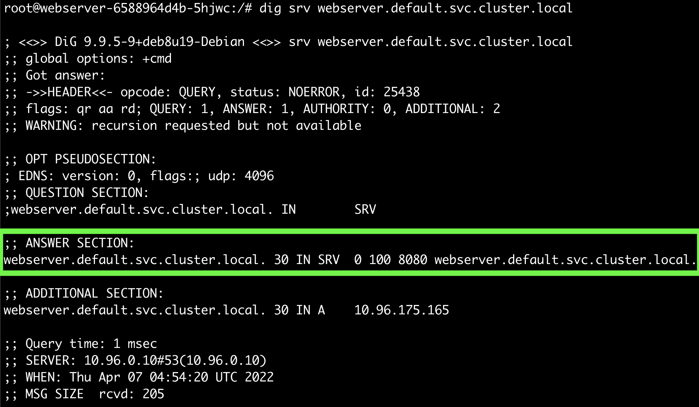
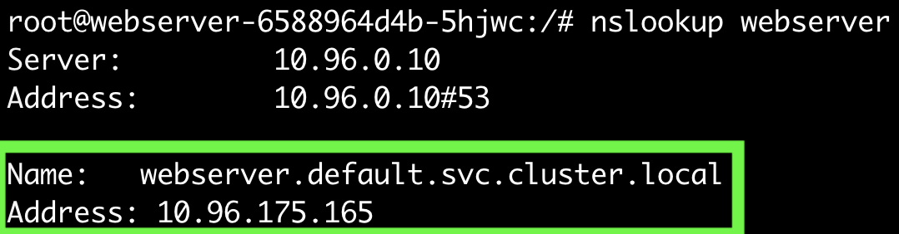
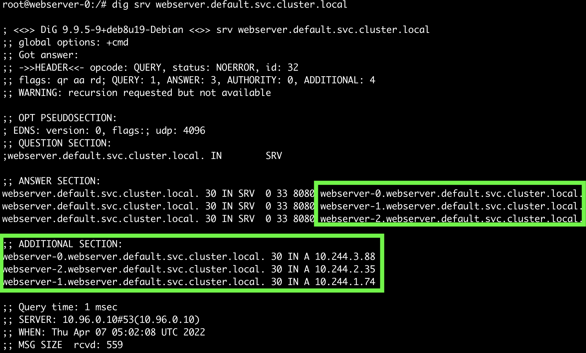
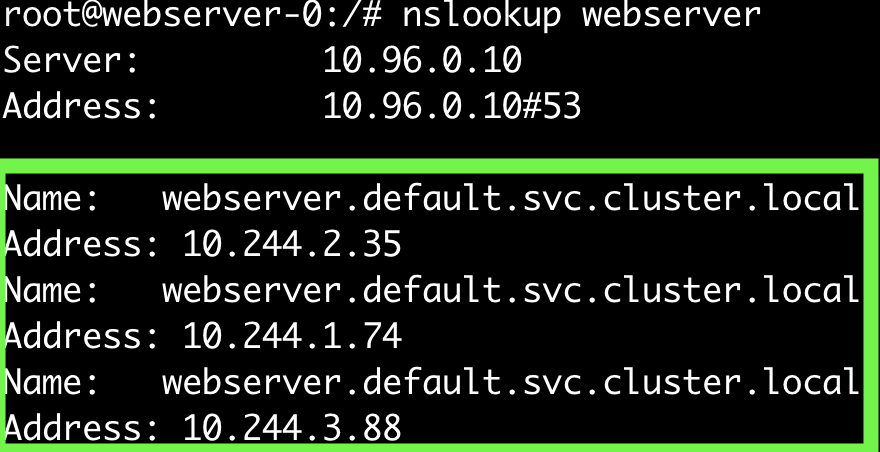
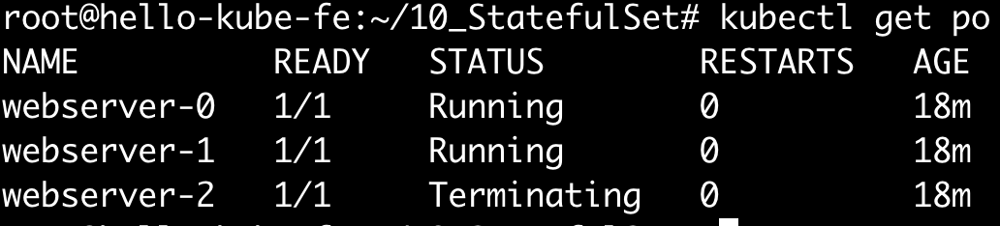
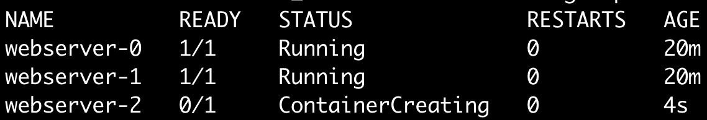
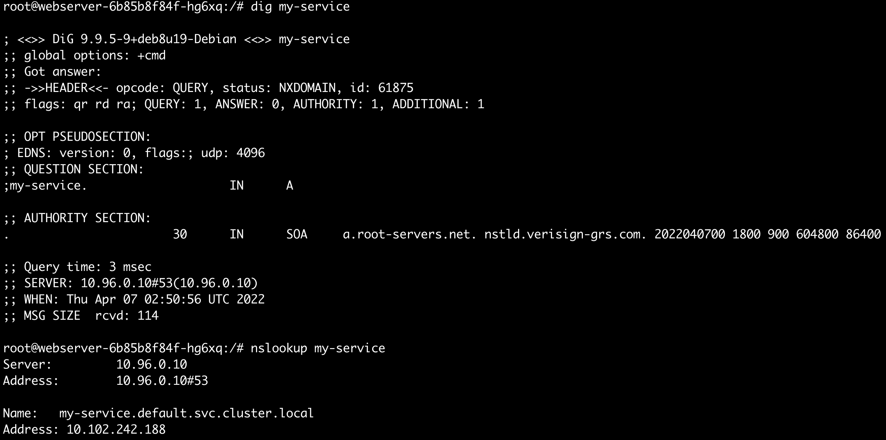

## StatefulSet
Deployment, ReplicaSet 등으로 생성한 Pod는 Stateless하다. 모든 Pod는 동일하며 구분될 필요가 없다.  
예를 들어, 3개의 replica가 소속된 Service에 요청을 보내면 어느 Pod에서 응답을 하더라도 상관이 없다.
    
하지만, 클라이언트에서 각 서버를 인지하고 있어야 하는 경우는 어떻게 할까? 예를 들어, kafka의 경우는 클러스터에 소속된 kafka broker의 endpoint를 알고 있어야 한다.    
각 Pod 별로 별도의 pvc를 보유해야 하는 경우는 어떻게 관리하면 좋을까?  

#### 가축과 애완동물
가축은 하나하나 구분될 필요가 없지만, 애완동물은 각각의 이름도 있고, 하나하나 전부 구분되어야 한다.  
Pod는 일반적으로 서로 구분될 필요가 없다. ReplicaSet이나 Deployment로 생성된 Pod는 가축이다.  
하나의 Pod가 비정상종료되고 새로운 Pod가 생성된다 하더라도, 가축이기 때문에 이는 구분될 필요가 없다.  
`pod-avvac` 가 종료되고 `pod-bacvc`가 생성되더라도 전혀 상관없다는 의미이다. 심지어 ip가 바뀌더라도 전혀 상관이 없다.
  
StatefulSet의 예전 이름은 PetSet이었다. StatefulSet으로 생성된 Pod는 전부 이름도 있고, 고정된 pvc를 가질 수도 있으며, 비정상종료로 인해 하나의 새로운 Pod가 생성된다면,  
이전의 Pod와 동일한 속성과 볼륨을 복구한다.

## 안정적인 네트워크 아이덴티티 제공하기
StatefulSet은 Headless Service와 연동하여 사용한다. 이렇게 함으로서 각각의 Pod에 고유한 도메인을 부여할 수 있다.  
Deployment로 생성한 것과 비교해보자.

#### Deployment
~~~yaml
apiVersion: v1
kind: Service
metadata:
  name: webserver
spec:
  selector:
    app: webserver
  ports:
      port: 8080
  # clusterIP: None
---
apiVersion: apps/v1
kind: Deployment
metadata:
  name: webserver
  labels:
    app: webserver
spec:
  replicas: 3
  selector:
    matchLabels:
      app: webserver
  template:
    metadata:
      labels:
        app: webserver
    spec:
      containers:
      - name: webserver
        image: outgrow0905/hostname
~~~
##### Pod

##### nslookup

##### dig

#### StatefulSet
~~~yaml
apiVersion: v1
kind: Service
metadata:
  name: webserver
spec:
  selector:
    app: webserver
  ports:
  - port: 8080
  clusterIP: None
---
apiVersion: apps/v1
kind: StatefulSet
metadata:
  name: webserver
  labels:
    app: webserver
spec:
  serviceName: "webserver"
  replicas: 3
  selector:
    matchLabels:
      app: webserver
  template:
    metadata:
      labels:
        app: webserver
    spec:
      containers:
      - name: webserver
        image: outgrow0905/hostname
        ports:
        - containerPort: 8080
~~~

##### Pod

##### nslookup

##### dig

## Pod 별로 고유한 pvc 생성하기
~~~yaml                                                                                                             38,12         All
apiVersion: v1
kind: Service
metadata:
  name: webserver
spec:
  selector:
    app: webserver
  ports:
  - port: 8080
  clusterIP: None
---
apiVersion: apps/v1
kind: StatefulSet
metadata:
  name: webserver
  labels:
    app: webserver
spec:
  serviceName: "webserver"
  replicas: 3
  selector:
    matchLabels:
      app: webserver
  template:
    metadata:
      labels:
        app: webserver
    spec:
      containers:
      - name: webserver
        image: outgrow0905/hostname
        ports:
        - containerPort: 8080
        volumeMounts:
        - name: www
          mountPath: /usr/share/nks-mount
  volumeClaimTemplates:
  - metadata:
      name: www
    spec:
      accessModes: ["ReadWriteOnce"]
      storageClassName: "nks-block-storage"
      resources:
        requests:
          storage: 1Gi
~~~ 

#### stable scale 확인
위의 예시에서 scale down 후 scale up 하여, `webserver-2` Pod의 볼륨내용이 유지/복구되는지 확인해보자.  
 
~~~
$ kubectl exec -it webserver-2 -- touch /usr/share/nks-mount/hello.txt
$ kubectl edit statefulset webserver // replicas: 2 로 변경하자 
~~~

replicas: 3 으로 변경하자 
~~~
$ kubectl edit statefulset webserver //replicas: 3 으로 변경하자
~~~

~~~
$ kubectl exec -it webserver-2 -- ls /usr/share/nks-mount/hello.txt
~~~

#### Update strategies
containers, labels, resource request/limits, annotations 등에 대한 항목의 변경을 반영하는 시점을 세팅할 수 있다.  
`.spec.updateStrategy`에서 설정할 수 있다. 
  
`OnDelete`: Pod에 변경사항이 있어도 즉시 반영하지 않는다. 변경사항은 Pod를 삭제하고 다시 생성할 때에만 반영한다.
`RollingUpdate`: 디폴트 값이다. 변경즉시 반영한다. `RollingUpdate`는 `.spec.updateStrategy.rollingUpdate.partition` 으로 세부 설정이 가능하다. Pod의 특정 번호 이상만 rolling update를 반영한다. canary 배포를 할때에 용이하다.

#### PersistentVolumeClaim retention (v1.23 [alpha])
Pod가 삭제되거나 혹은 scale up/down 될때에 pvc가 어떤 정책으로 관리될 지 설정할 수 있다.
`.spec.persistentVolumeClaimRetentionPolicy`에서 설정할 수 있으며, [feature gate](https://kubernetes.io/docs/reference/command-line-tools-reference/feature-gates/)의 `StatefulSetAutoDeletePVC`항목에서 enable로 세팅해야 한다.

~~~yaml
apiVersion: apps/v1
kind: StatefulSet
...
spec:
  persistentVolumeClaimRetentionPolicy:
    whenDeleted: Retain
    whenScaled: Delete
...
~~~

`whenDeleted`와 `whenScaled`를 선택해야 한다.

`whenDeleted`: Pod가 삭제될 때에 pvc를 `Delete` 할 지, `Retain`할 지 세팅할 수 있다. `Retain`이 기본값이다.
`whenScaled`: Pod가 scale up/down될 때에 pvc를 `Delete` 할 지, `Retain`할 지 세팅할 수 있다. `Retain`이 기본값이다.

이 설정에서 주의할 점은, 이러한 설정이 Pod가 Delete되거나 scale up/down 될 때에만 적용된다는 부분이다. 만약 node 자체가 down된다면 어떻게 될까?  
control plane은 새로운 Pod를 reschedule 할때에 기존의 pvc를 retain하여 새로운 Pod를 생성한다.

## Reference
- https://kubernetes.io/docs/concepts/workloads/controllers/statefulset/
- https://kubernetes.io/docs/tasks/run-application/force-delete-stateful-set-pod/