## network
flannel CNI를 기준으로 패킷을 추적해보려고 한다.

## nodePort 패킷을 따라가보자.
~~~yaml
apiVersion: v1
kind: Service
metadata:
  name: hostname
spec:
  selector:
    app: hostname
  ports:
  - port: 8080
    nodePort: 31921
  type: NodePort
---
apiVersion: apps/v1
kind: Deployment
metadata:
  name: hostname
  labels:
    app: hostname
spec:
  replicas: 3
  selector:
    matchLabels:
      app: hostname
  template:
    metadata:
      labels:
        app: hostname
    spec:
      containers:
      - name: hostname
        image: outgrow0905/hostname
        ports:
        - containerPort: 8080
~~~

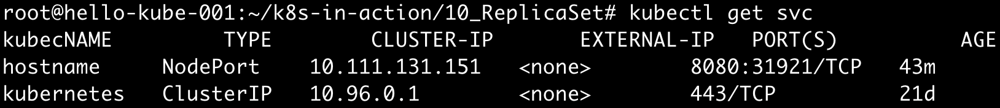

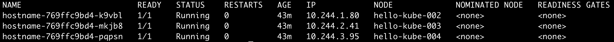

~~~
$ curl 192.168.100.6:31921
  You've hit hostname-769ffc9bd4-pqpsn
~~~

성공했다. 이제 패킷을 추적해보자.

#### 패킷 확인
`tcpdump`는 `iptables` 보다 먼저 적용되므로 iptables의 정책이 적용되기 전의 패킷을 볼 수 있다.  
`31921` 포트로 패킷이 잘 들어왔다.    
그리고 바로 `iptables`의 정책이 적용되었을 것이다. `iptables`를 확인해보자.

~~~
$ tcpdump -i eth0 -ne tcp  port 31921 -vv -c 10
~~~

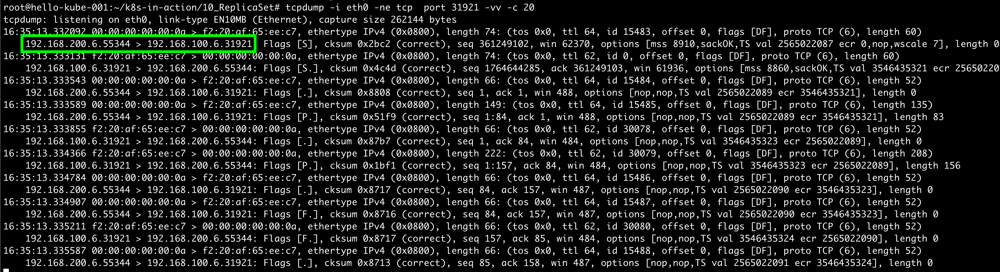

#### iptables 확인
아래 캡쳐를 확인해보면, `KUBE-SERVICES` Chain을 확인해보자.  
source와 destination이 전부 `anywhere`이다. 
들어오고 나가는 모든 패킷이 `KUBE-SERVICES` Chain에 적용되는 것을 확인할 수 있다. 

~~~
$ iptables --table nat -L OUTPUT | column -t
~~~

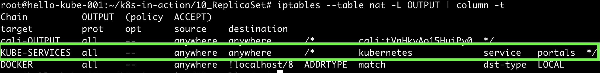

#### `KUBE-SERVICES` 확인
Chain은 Rule에 매핑되어있다.  
`KUBE-SERVICES` Chain에 어떤 Rule이 매핑되어있는 지 확인해보자.  
아래 캡쳐를 확인해보면, `KUBE-SVC-3GKU6HOD7ODCVBMB` 가 우리가 찾는 서비스이다.   
그런데, 해당 Rule로 걸렸을까? 아니다.   
들어온 요청은 `192.168.100.6:31921` 으로 요청이 들어왔기 때문에 `KUBE-NODEPORTS`의 Rule로 적용되었을 것이다.
 
 ~~~
 $ iptables --table nat -L KUBE-SERVICES -n | column -t
 ~~~
 
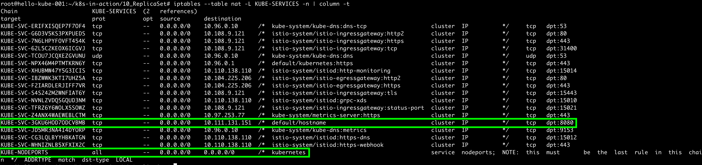

#### `KUBE-NODEPORTS` 확인
`dpt:31921`가 보인다. 이제 해당 `KUBE-SVC-3GKU6HOD7ODCVBMB` Rule에 적용되었을 것임을 쉽게 알 수 있다.  

 ~~~
 $ iptables --table nat -L KUBE-NODEPORTS -n | column -t
 ~~~

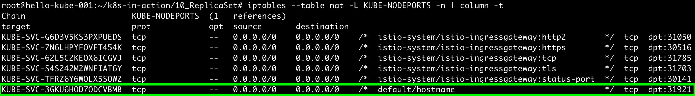

#### `KUBE-SVC-3GKU6HOD7ODCVBMB` 확인
여기서 `KUBE-MARK-MASQ` 에 의해 source ip가 호스트의 `flannel.1` 인터페이스의 ip 로 `SNAT` 되고, 
iptables의 statistics에 의해 로드밸런싱된다(고 한다).   

아래의 watch 명령어를 보면 패킷이 들어올 때마다 `KUBE-MARK-MASQ` 과 특정 `SEP*`의 카운트가 같이 올라간다.

~~~
$ iptables --table nat -L KUBE-SEP-F2HHAFIGNABDY5LO -n | column -t
$ watch -n 1 iptables -t nat -L KUBE-SVC-3GKU6HOD7ODCVBMB -nv
~~~

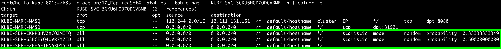

#### iptables 로드밸런싱 확인
세 개의 로드밸런싱 중 하나를 확인해보자. `DNAT` 되는 것을 확인할 수 있다.  
드디어, Pod중 하나인 `10.244.3.95:8080`으로 패킷이 향하게 되었다.

~~~
$ iptables --table nat -L KUBE-SEP-F2HHAFIGNABDY5LO -n | column -t
~~~

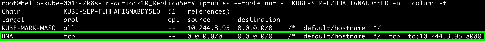

#### master node의 flannel.1 인터페이스 패킷 확인
src는 master node의 flannel.1 인터페이스인 `10.244.0.0:61984(랜덤 포트)` 인 것을 알수 있고,  
dst는 위의 과정에 따라 `10.244.3.95.8080`인 것을 확인할 수 있다.

~~~
$ tcpdump -i flannel.1   -ne tcp  -vv -c 10 
~~~

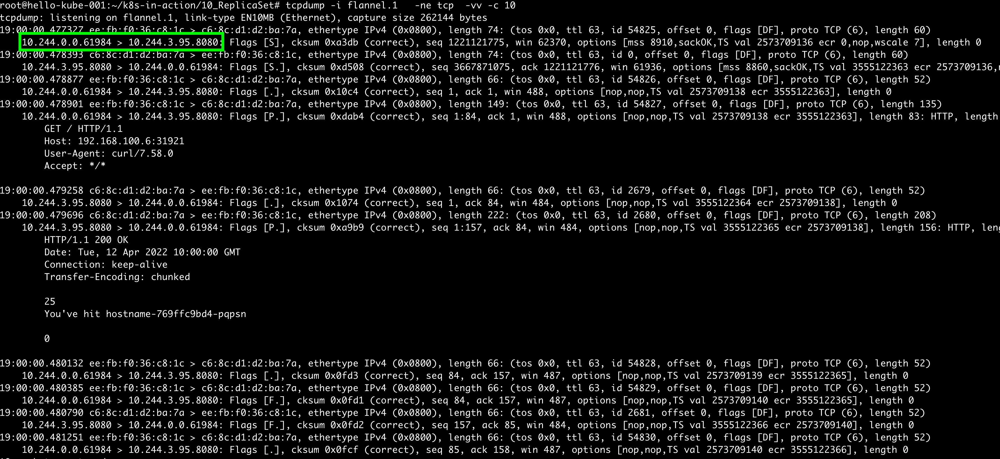

#### worker node에서 패킷 확인
패킷을 확인해보면 패킷이 캡슐화되어서 들어왔고 (위의 초록 네모), flannel 이 캡슐화를 해지한 값도 같이 볼 수 있다(아래 초록 네모).

~~~
$ tcpdump -i eth0 -ne udp -vv -c 10
~~~

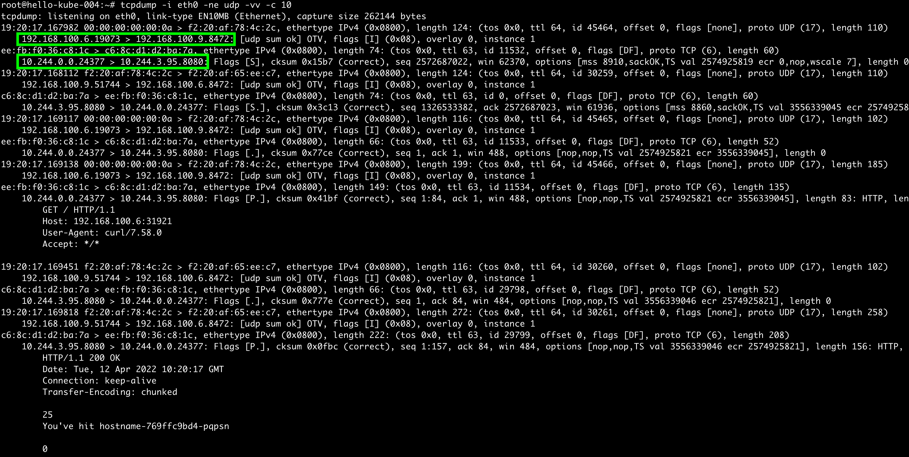

#### worker node의 flannel.1 인터페이스 패킷 확인

~~~
$ tcpdump -i flannel.1 -ne tcp  -vv -c 10
~~~

#### worker node의 cni0 인터페이스 패킷 확인
자세히 보면 source의 mac주소가 호스트(worker node)의 cni0의 mac 주소인 것을 볼 수 있다.

~~~
$ tcpdump -i cni0 -ne tcp and dst 10.244.3.95 -vv -c 10
~~~

#### worker node의 목적지 Pod의 veth 인터페이스 패킷 확인
Pod와 연결된 `veth3b182d71`는 어떻게 찾을 수 있을까? 아래 Ref에서 알아보자.

~~~
$ tcpdump -i veth3b182d71  -ne tcp  -vv -c 10
~~~

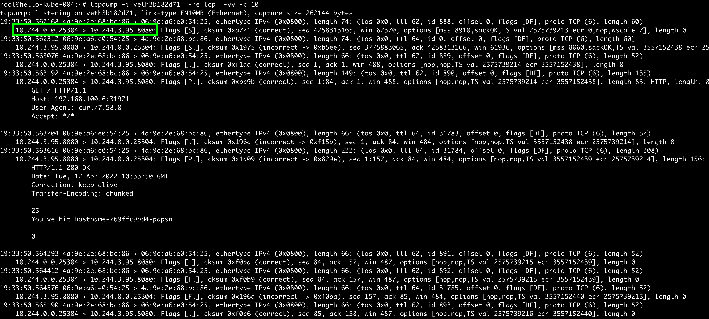

#### Pod에서 패킷 확인

~~~
$ tcpdump -i eth0 -ne tcp  port 8080 -vv -c 10
~~~

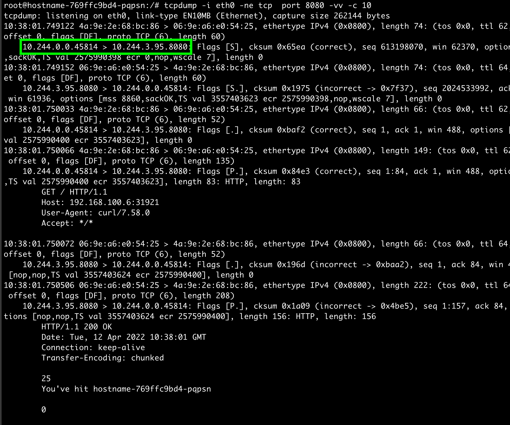

## Reference
- https://ikcoo.tistory.com/164
- https://ikcoo.tistory.com/103