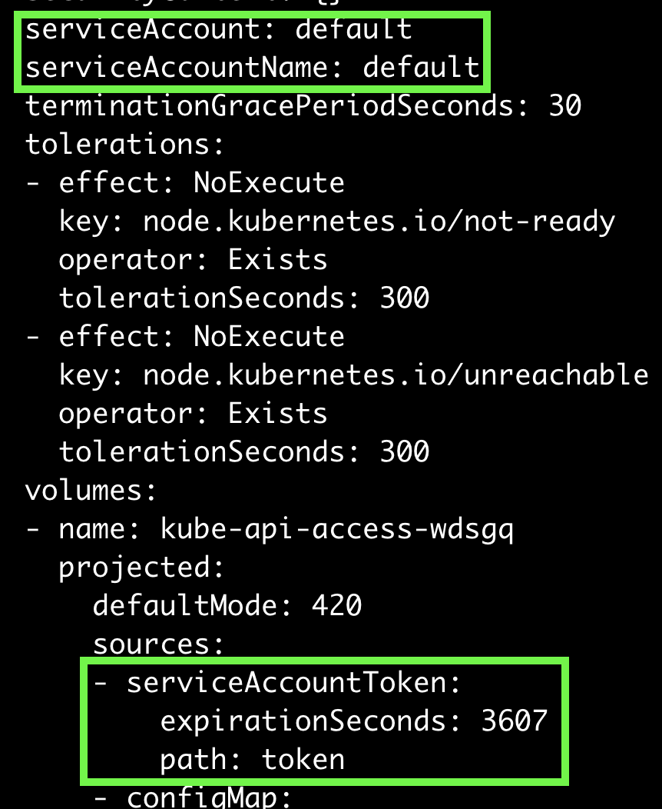
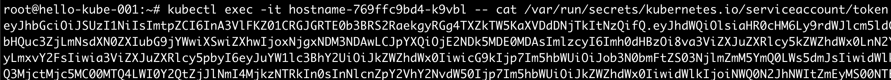
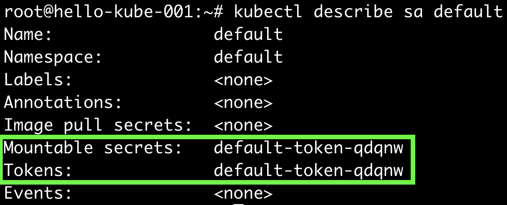
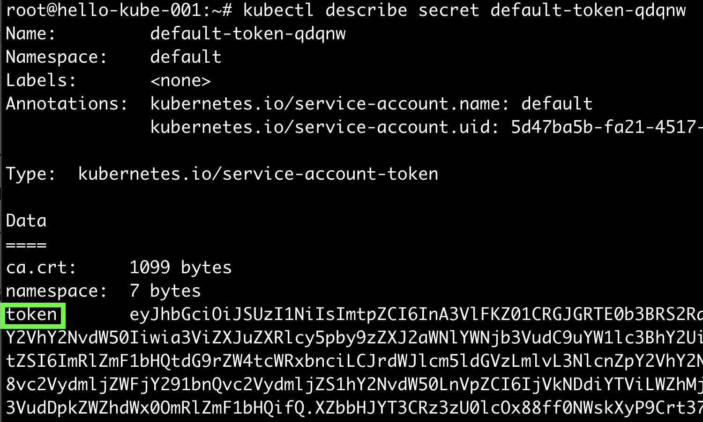
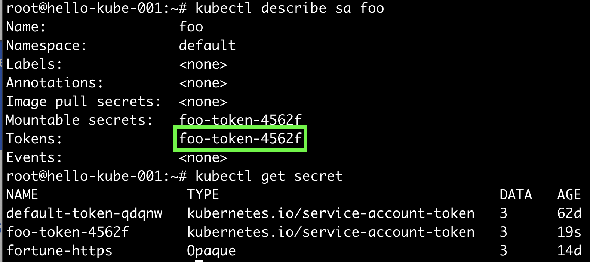

## ServiceAccount
kubernetes api server로 요청을 하는 클라이언트는 두 종류로 나뉜다.    
우리가 마스터노드에서 cli로 수없이 수행헀던 `kubectl`은 말그대로 실제사람, `UserAccount`이다.  
Pod에 속한 프로세스에서 api server로의 요청은 `ServiceAccount`이다.  
ServiceAccount는 Pod에서 실행중인 프로세스의 정체성을 부여한다.  

ServiceAccount는 권한이 제한되어있다. 관리자의 제어에 따라 특정 ServiceAccount는 Pod를 조회할 수 있고, 또 다른 ServiceAccount는 그렇지 못할 수 있다.  
Pod 생성시에 ServiceAccount를 별도로 세팅하지 않으면, AdmissionController가 자동으로 `default` ServiceAccount를 할당한다.  
그리고, `default` ServiceAccount가 가지고 있는 `token`도 Pod로 mount한다.

## Pod와 ServiceAccount 같이 살펴보기  
~~~ssh
$ kubectl get  po hostname-769ffc9bd4-k9vbl -o yaml
~~~ 

serviceAccount는 default로 자동으로 세팅되어있고, token을 보니 ServiceAccount 어디선가 값을 가져와서 세팅하는 것처럼 보인다.  
일단 값을 보자.

~~~
$ kubectl exec -it hostname-769ffc9bd4-k9vbl -- cat /var/run/secrets/kubernetes.io/serviceaccount/token
~~~

token을 확인하였으니 어디로부터 이 값을 가져왔는 지 알기 위해 ServiceAccount를 살펴보자.

~~~
$ kubectl describe sa default
~~~ 

`default-token-qdqnw` 가 Secret 리소스로 있을 것만 같다. 살펴보자.

~~~
$ kubectl describe sa default
~~~

위에서 Pod에 세팅된 token과 일치한다.  
Pod 생성시에 컨테이너에 `default` ServiceAccount가 자동으로 세팅되고, `default` ServiceAccount는 특정 Secret을 보유하고 있으며, 해당 Secret의 token을 가져오는 것을 확인하였다.
그렇다면, `default` ServiceAccount는 도대체 어떤 권한을 가지고 있을까?  

## ServiceAccount 생성해보기
~~~
$ kubectl create serviceaccount foo
  serviceaccount/foo created
$ kubectl describe sa foo
~~~

~~~
$ kubectl describe secret foo-token-4562f
~~~
결과를 보면 `default` ServiceAccount에 세팅된 `token`과 동일한 것을 확인할 수 있다.
새로 생성한 `foo` ServiceAccount로 Pod를 생성해보자.  
이미지는 ambassador pattern에서 사용한 것을 그대로 사용한다.

~~~yaml
apiVersion: v1
kind: Pod
metadata:
  name: my-pod
spec:
  serviceAccountName: foo
  containers:
  - image: outgrow0905/hostname
    name: my-container
  - image: outgrow0905/kubectl-proxy
    name: my-proxy
~~~

~~~
$ kubectl exec -it my-pod -c my-container -- cat /var/run/secrets/kubernetes.io/serviceaccount/token
~~~

`foo` ServiceAccount에 매핑된 Secret의 `token`과 동일하다.

~~~
$ kubectl exec -it my-pod -c my-container -- curl localhost:8001/api/v1/pods
~~~

위 api는 모든 namespace의 Pod를 조회하는 요청이다. `foo` ServiceAccount에는 어디까지 권한이 세팅된걸까.

## Namespace에서 ServiceAccount 테스트
`default` namespace에서 `foo` ServiceAccount를 생성하고 테스트하니 권한이 전부 세팅된 것 같다.  
namespace를 새로 세팅하고 테스트해보자.  
 
~~~
$ kubectl create namespace foo
$ kubectl run test --image=outgrow0905/kubectl-proxy -n foo
$ kubectl create namespace bar
$ kubectl run test --image=outgrow0905/kubectl-proxy -n bar
~~~

~~~
$ kubectl exec -it test -n foo -- curl localhost:8001/api/v1/namespaces/foo/services
~~~

~~~json
{
  "kind": "Status",
  "apiVersion": "v1",
  "metadata": {},
  "status": "Failure",
  "message": "services is forbidden: User \"system:serviceaccount:foo:default\" cannot list resource \"services\" in API group \"\" in the namespace \"foo\"",
  "reason": "Forbidden",
  "details": {
    "kind": "services"
  },
  "code": 403
}
~~~

실패했다. 메시지를 분석해보면,   
`foo` namespace의 `system:serviceaccount:foo:default` ServiceAccount가 API group `""`에 속한 `services` 리소스에 대해 `list`권한이 없는 것이다.  

위의 오류메시지에 따라, `foo` namespace의 API group `""`의 `services` 리소스에 대해 `list` 권한을 먼저 생성해보자.

~~~yaml
apiVersion: rbac.authorization.k8s.io/v1
kind: Role
metadata:
  namespace: foo
  name: service-reader
rules:
  - apiGroups: [""]
    verbs: ["get", "list"]
    resources: ["services"]
~~~

위의 Role 에서 하나 빠진것이 보인다. 어떤 ServiceAccount에 위의 Role을 부여할 지이다.  
Role과 ServiceAccount의 바인딩은 RoleBinding을 통해서 한다.

~~~
$ kubectl create rolebinding test --role=service-reader --serviceaccount=foo:default -n foo
$ kubectl exec -it test -n foo -- curl localhost:8001/api/v1/namespaces/foo/services
~~~

성공했다. 혹시 `bar` namespace의 service도 조회할 수 있을까? 

~~~  
$ kubectl exec -it test -n foo -- curl localhost:8001/api/v1/namespaces/bar/services
~~~

안된다. RoleBinding을 고쳐보자.

~~~
$ kubectl edit rolebinding test -n foo
~~~
~~~yaml
apiVersion: rbac.authorization.k8s.io/v1
kind: RoleBinding
metadata:
  creationTimestamp: "2022-04-14T05:12:55Z"
  name: test
  namespace: foo
  resourceVersion: "11009206"
  uid: f041587f-8b2e-43af-96d0-08bb0dcda4cf
roleRef:
  apiGroup: rbac.authorization.k8s.io
  kind: Role
  name: service-reader
subjects:
- kind: ServiceAccount
  name: default
  namespace: foo
- kind: ServiceAccount   # 추가
  name: default          # 추가
  namespace: foo         # 추가
~~~

위의 설정에서 추가한 부분은 어떤 것을 의미할까? Role은 `Namespaced` 리소스이다. 따라서,
`foo` namespace에 소속된 Service 리소스에 대한 `list` 권한을 `bar` namespace의 `default` ServiceAccount에게 부여한 것이다.
위 설정에 따라,
`foo` namespace의 `default` ServiceAccount는 여전히 `bar` namespace의 Service를 조회할 수 없다.  

~~~
$ kubectl exec -it test -n foo -- curl localhost:8001/api/v1/namespaces/bar/services # 실패
$ kubectl exec -it test -n bar -- curl localhost:8001/api/v1/namespaces/foo/services # 성공
~~~

불편하다. 어떤것이 불편한가?  

관리자 입장에서 namespace는 규모에 따라 수없이 많을 수 있다.      
새롭게 생성되는 namespace마다 적어도 자기 자신의 namespace에 대해서는 Pod, Service, Deployment의 list, get 권한을 부여하고 싶을 수 있다.  

그렇다면, namespace 생성시마다 똑같은 Role을 계속해서 만들어주어야 할 것이다. 

## ClusterRole & ClusterRoleBinding
ClusterRole은 Namespaced되지 않는 kubenetes 리소스를 제어하기 위한 것이다. 대략적인 사용은 위의 Role & RoleBinding과 비슷하다.  
다만, ClusterRole은 단지 Namespaced되지 않는 리소스만을 위한것은 아니다. 

ClusterRole에 Namespaced 리소스를 바인딩하는 것은 어떤 의미일까?  
ClusterRole을 RoleBing하는 것은 어떤 의미일까?

기존의 RoleBinding을 삭제하고 아래 명령어를 수행해보자.

~~~
$ kubectl exec -it test -n foo -- curl localhost:8001/api/v1/namespaces/foo/services # foo namespace의 Service 조회
~~~
다시 실패한다. 당연하다.

~~~
$ kubectl exec -it test -n foo -- curl localhost:8001/api/v1/pods # 클러스터 내의 모든 Pod 조회  
~~~

~~~yaml
{
  "kind": "Status",
  "apiVersion": "v1",
  "metadata": {},
  "status": "Failure",
  "message": "pods is forbidden: User \"system:serviceaccount:foo:default\" cannot list resource \"pods\" in API group \"\" at the cluster scope",
  "reason": "Forbidden",
  "details": {
    "kind": "pods"
  },
  "code": 403
}
~~~
오류메시지를 보면, `클러스터 단위(cluster scope)`의 모든 Pods에 대하여 `list` 권한이 없다는 의미이다.  
`view` ClusterRole은 대부분의 리소스에 대해 조회 권한이 있는 리소스이다. 이를 가지고 테스트해보자.

~~~
$ kubectl get clusterrole view -o yaml
~~~

#### ClusterRole을 ClusterRoleBinding
~~~
$ kubectl create clusterrolebinding view-test --clusterrole=view --serviceaccount=foo:default
$ kubectl exec -it test -n foo -- curl localhost:8001/api/v1/namespaces/foo/services 
$ kubectl exec -it test -n foo -- curl localhost:8001/api/v1/pods
~~~
성공한다. foo namespace의 default ServiceAccount는 클러스터내의 모든 Pod를 조회할 수 있고,   
자기 자신이 속한 foo namespace의 service도 당연히 조회할 수 있게 되었다.

#### ClusterRole을 RoleBinding
위의 clusterrolebinding은 삭제하고 테스트한다.
~~~
$ kubectl delete clusterrolebinding view-test
$ kubectl create rolebinding view-test -n foo --clusterrole=view --serviceaccount=foo:default
$ kubectl exec -it test -n foo -- curl localhost:8001/api/v1/namespaces/foo/services # 성공
$ kubectl exec -it test -n foo -- curl localhost:8001/api/v1/pods # 실패
~~~
불필요하게 Role을 생성하지 않고, `view` ClusterRole을 재활용하여 사용할 수 있게 되었다.  
**ClusterRole을 RoleBing하는 것은 일종의 권한 템플릿을 만들어두고, 이를 Namespace마다 공유하여 사용할 수 있도록 하게 하는 편리함을 제공한다.** 
