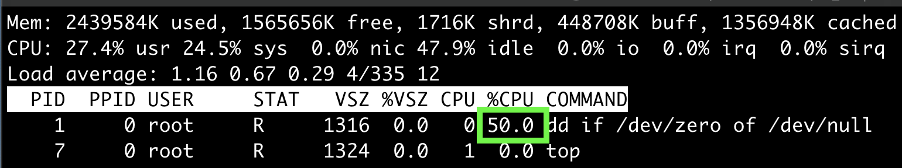
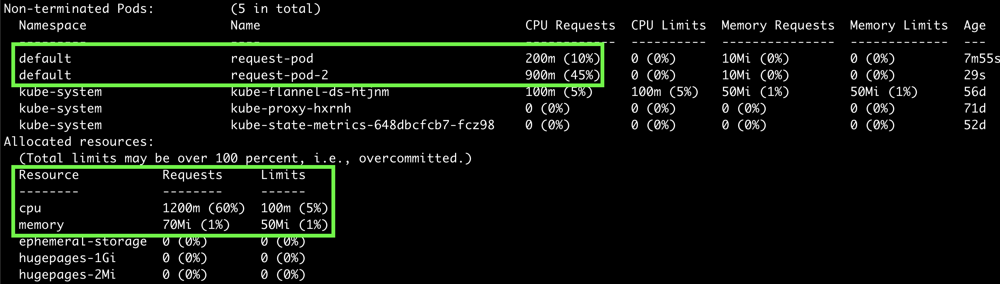

## Request, Limit
Pod를 생성할 때 컨테이너가 필요로 하는 CPU와 메모리가 있을 것이다. 이를 Request라고 부른다.  
또한, 컨테이너가 사용할 수 있는 리소스의 최대치를 제한할 수 있다. 이를 Limit이라고 한다.  
컨테이너단위로 지정되며, 각 컨테이너의 Request, Limit의 합이 Pod의 리소스 Request, Limit 이라고 할 수 있다.  

kubernetes scheduler는 Request를 보고 어떤 노드에 Pod를 할당할 지 판단한다.  
어떤 기준일까?

#### LeastRequestedPriority, MostRequestedPriority
당연히 Request가 가장 적게 사용되고 있는 노드에 할당하는 것이 좋을 것이라고 생각된다. 이것이 `LeastRequestedPriority` 정책이다.  
그렇다면, `MostRequestedPriority`는 왜 사용하는 것일까? 클라우드 환경에서는 노드 운영자체가 비용이다. 이 정책을 활용하면 노드 하나를 최대한으로 활용할 수 있다.

## Request
~~~yaml
apiVersion: v1
kind: Pod
metadata:
  name: request-pod
spec:
  containers:
  - image: busybox
    command: ["dd", "if=/dev/zero", "of=/dev/null"]
    name: main
    resources:
      requests:
        cpu: 200m
        memory: 10Mi
~~~

~~~
$ kubectl exec -it request-pod top
~~~

 
위의 Pod가 실행되는 노드는 2 core 의 스펙이다. 그런데 50%의 cpu 사용률은 1 core를 사용하고 있다는 의미이다.  
이는 Limit을 정하지 않아서, 제한된 200m 보다 더 많이 사용하고 있기 때문이다. 현재 최대한으로 cpu를 활용하고 있는데 50%인 경우는 해당 프로세스가 쓰레드가 하나이기 때문이다.
 
하나 더 생성해보자.
~~~
$ kubectl run request-pod-2 --image=busybox --restart Never --requests='cpu=800m,memory=20mi' -- dd if=/dev/zero of=/dev/null
  pod/request-pod-2 created
~~~

`Running` 상태로 잘 작동한다. 하나 더 생성해보자.

~~~
$ kubectl run request-pod-3 --image=busybox --restart Never --requests='cpu=1,memory=20mi' -- dd if=/dev/zero of=/dev/null
  pod/request-pod-3 created
~~~ 

성공한줄 알았다. 하지만, 생성된 Pod를 검색하면 `Pending` 상태이다.  
노드 상태를 보자.

~~~
$ kubectl describe node
~~~

내가 생성한 Pod 이외에, `kube-system` namespace로 생성한 Pod 들이 차지하는 cpu도 있어서, 가용량은 900mi 이기 때문에 할당이 안된 것으로 추측할 수 있다.  
`request-pod-2`를 삭제하면 `Pending` 상태의 `request-pod-3` Pod가 성공적으로 생성된다.

## Limit
~~~yaml
apiVersion: v1
kind: Pod
metadata:
  name: limit-pod
spec:
  nodeSelector:
    gpu: "true"
  containers:
  - image: busybox
    command: ["dd", "if=/dev/zero", "of=/dev/null"]
    name: main
    resources:
      limits:
        cpu: 1
        memory: 20Mi
~~~
메모리 위주로 살펴보자. cpu랑 비슷하게 생각해보면, 생성된 컨테이너는 20Mi 이상의 메모리를 사용하지 못할 것처럼 생각할 수 있다.  
하지만, 컨테이너는 노드의 메모리사용량을 볼 수 있을 뿐이다.  
자바 어플리케이션을 예로 들면, `-Xms` 옵션을 50Mi로 설정했다면, 실제 어플리케이션은 필요한 경우 50Mi 만큼의 메모리를 할당하려고 시도할 것이다.  
그리고, kubelet은 이를 감지하고, `OOMKilled` 메세지와 함께 해당 컨테이너를 재시작 할 것이다.  
그렇다면, `-Xms` 옵션만 잘 세팅하면 될까? 아니다. 이는 심지어 `off-heap` 은 반영하지 않은 값이다. 
하지만, JVM 1.8 이상버전부터는 -XX:+UseCGroupMemoryLimitForHeap 옵션을 통해, 컨테이너의 메모리를 최대 Heap 크기로 설정하여 할당하는게 가능해졌다.

## Reference
- https://kubernetes.io/docs/concepts/configuration/manage-resources-containers/