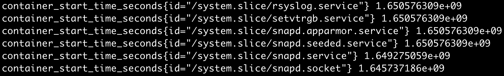

## Monitoring
kubernetes 클러스터 관리자라면 모니터링을 고민할 것이다. 특정 컨테이너의 메모리사용이 지나치지는 않은 지, CPU 사용률이 지나치게 높지는 않은 지,  
혹은 컨테이너를 넘어서 특정 노드의 디스크가 꽉 차지는 않았는 지 등 모니터링 해야 할 것이 많다. 이러한 정보들은 어떻게 얻어와서, 어떻게 관리할 수 있을까?  

먼저, 위에서 이야기한 것만으로 우리는 정보들을 두 가지로 분류할 수 있다.  
컨테이너 수준의 정보와 노드 수준의 정보는 분명 다를 것이다. 앞으로 이 정보들을 metric이라고 칭한다.

- 인프라 수준의 메트릭: 호스트 레벨에서의 metric을 의미한다. kubernetes에서는 노드 수준의 metric이다. 특정 노드에 마운트되어 있는 디스크의 사용량, 패킷 사용량 등 노드 수준의 정보이다.
- 컨테이너 수준의 메트릭: 컨테이너 별 metric을 의미한다. kubernetes에서는 Pod 혹은 Pod의 특정 컨테이너 수준의 metric이다. 컨테이너 별 CPU, 메모리의 사용량, 특정 컨테어너에 할당된 리소스의 할당량 등이 될 수 있다. 

## Monitoring 구축하기 전
#### cAdvisor
kubernetes는 기본적으로 kubelet에 `cAdvisor`를 내장하고 있다. `cAdvisor`는 노드내의 컨테이너의 metric을 수집한다.  
각 노드단위로만 `cAdvisor`가 있기 때문에 특정 노드에서 구동중인 컨테이너 metric을 수집하려면 특정 노드에 질의해야 한다.  
예를 들어, kubernetes 클러스터 내의 모든 노드의 CPU 사용현황을 모아서 볼 수는 없는 것이다.  

#### metrics-server
이를 한 곳에서 처리하기 위한 역할을 `metrics-server`가 한다.   
`metrics-server`는 모든 노드의 kubelet으로부터 metric을 수집한다. 그리고 이를 Metrics API를 통해 외부에 제공한다.  
`kubectl top`과 같은 명령어는 Metrics API에 질의하는 cli이다.

#### prometheus & grafana
`prometheus`는 `metrics-server`로부터 metric을 수집하여 `grafana`를 통해 시각화한다.

## 실습
#### step1: cAdvisor 들여다보기
kubernetes 각 노드는 `cAdvisor`를 기본적으로 내장하고 있다. 별도의 `cAdvisor` 컨테이너를 띄워서 어떤 정보들이 들어오는 지 살펴보자.

~~~
$ docker run --volume=/:/rootfs:ro --volume=/var/fun:/var/run:ro --volume=/sys:/sys:ro --volume=/var/lib/docker/:/var/lib/docker:ro --volume=/dev/disk/:/dev/disk:ro --publish=8080:8080 --detach=true --name=cadvisor google/cadvisor
~~~

`cAdvisor`는 기본적으로 `/metrics` 경로를 통해 metric을 제공한다. 컨테이너를 띄울 때 8080 포트로 설정하였으므로, 아래 명령어를 실행하여 어떤 metric이 있는 지 들여다보자.

~~~
$ curl localhost:8080/metrics
~~~

데이터의 형식을 살펴보면 `metric명{key} value`의 형식인 것을 알 수 있다.   
모든 정보가 필요하지는 않을 것이다. 앞으로 살펴볼 `prometheus`가 `cAdvisor`로부터 수집하는 metric들은 [cAdvisor github](https://github.com/google/cadvisor/blob/master/docs/storage/prometheus.md)에서 확인할 수 있다.

#### step2: kubelet을 통해 각 노드의 metric 살펴보기
kubelet이 `cAdvisor`를 내장하고 있고, `cAdvisor`는 노드내의 컨테이너의 metric을 수집한다고 하였다.  
kubelet은 `10250` 포트의 `/metrics` path를 통해 컨테이너 metric을 제공한다. 사용해보자.

~~~
$ kubectl get secret -n kube-system | grep metrics-server
  metrics-server-token-wrt68
$ kubectl describe secret metrics-server-token-wrt68 -n kube-system
$ kubectl get secret metrics-server-token-wrt68 -n kube-system -o jsonpath={.data.token} | base64 -d
$ export METRICKEY=$(kubectl get secret metrics-server-token-wrt68 -n kube-system -o jsonpath={.data.token} | base64 -d)
$ curl https://{hostip}:10250/metrics -k -H "Authorization: Bearer $METRICKEY"
~~~ 

아까 `cAdvisor`를 통해 살펴봤던 정보와 비슷한 것을 알 수 있다.

#### step3: metric-server 구축하기
설치는 간단하다. [metric-server github](https://github.com/kubernetes-sigs/metrics-server)에서 제공하는 파일을 적용한다.

~~~
$ kubectl apply -f https://github.com/kubernetes-sigs/metrics-server/releases/latest/download/components.yaml
~~~

위의 파일을 조금씩 나누어서 분석해보자.

~~~yaml
apiVersion: v1
kind: ServiceAccount
metadata:
  labels:
    k8s-app: metrics-server
  name: metrics-server
  namespace: kube-system
~~~

`kube-system` namespace에 `metrics-server`라는 이름의 ServiceAccount를 생성한다.

~~~yaml
apiVersion: rbac.authorization.k8s.io/v1
kind: ClusterRole
metadata:
  labels:
    k8s-app: metrics-server
    rbac.authorization.k8s.io/aggregate-to-admin: "true"
    rbac.authorization.k8s.io/aggregate-to-edit: "true"
    rbac.authorization.k8s.io/aggregate-to-view: "true"
  name: system:aggregated-metrics-reader
rules:
- apiGroups:
  - metrics.k8s.io
  resources:
  - pods
  - nodes
  verbs:
  - get
  - list
  - watch
---
apiVersion: rbac.authorization.k8s.io/v1
kind: ClusterRole
metadata:
  labels:
    k8s-app: metrics-server
  name: system:metrics-server
rules:
- apiGroups:
  - ""
  resources:
  - nodes/metrics
  verbs:
  - get
- apiGroups:
  - ""
  resources:
  - pods
  - nodes
  verbs:
  - get
  - list
  - watch
~~~

`metrics.k8s.io` apiGroup의 `pods, nodes` 리소스에 대하여 `get, list, watch` 권한이 있는 `system:aggregated-metrics-reader` ClusterRole을 생성한다.  
`""` apiGroup의 `pods, nodes` 리소스에 대하여 `get, list, watch` 권한이 있는 `system:metrics-server` ClusterRole을 생성한다.

~~~yaml
apiVersion: rbac.authorization.k8s.io/v1
kind: RoleBinding
metadata:
  labels:
    k8s-app: metrics-server
  name: metrics-server-auth-reader
  namespace: kube-system
roleRef:
  apiGroup: rbac.authorization.k8s.io
  kind: Role
  name: extension-apiserver-authentication-reader
subjects:
- kind: ServiceAccount
  name: metrics-server
  namespace: kube-system
~~~

`extension-apiserver-authentication-reader` Role을 위에서 생성한 `metrics-server` ServiceAccount에 부여한다.
`extension-apiserver-authentication-reader` Role을 살펴보자.

~~~
$ kubectl get role extension-apiserver-authentication-reader -o yaml -n kube-system
~~~
`configmaps` 리소스에 대하여 `get, list, watch` 권한이 있는 것을 알 수 있다.

~~~yaml
apiVersion: rbac.authorization.k8s.io/v1
kind: ClusterRoleBinding
metadata:
  labels:
    k8s-app: metrics-server
  name: metrics-server:system:auth-delegator
roleRef:
  apiGroup: rbac.authorization.k8s.io
  kind: ClusterRole
  name: system:auth-delegator
subjects:
- kind: ServiceAccount
  name: metrics-server
  namespace: kube-system
---
apiVersion: rbac.authorization.k8s.io/v1
kind: ClusterRoleBinding
metadata:
  labels:
    k8s-app: metrics-server
  name: system:metrics-server
roleRef:
  apiGroup: rbac.authorization.k8s.io
  kind: ClusterRole
  name: system:metrics-server
subjects:
- kind: ServiceAccount
  name: metrics-server
  namespace: kube-system
~~~

`system:auth-delegator` ClusterRole을 `metrics-server` ServiceAccount에 부여한다.  
`metric-server`와 관계없이 이미 생성되어있는 ClusterRole인 것으로 보인다. `system:auth-delegator`를 살펴보자.

~~~
$ kubectl get clusterrole system:auth-delegator -o yaml
~~~

`tokenreviews, subjectaccessreviews` 리소스에 대하여 `create` 권한을 부여하는 것을 알 수 있다.

`system:metrics-server` ClusterRole은 위에서 생성하였다. `metrics-server` ServiceAccount에 부여한다.

~~~yaml
apiVersion: v1
kind: Service
metadata:
  labels:
    k8s-app: metrics-server
  name: metrics-server
  namespace: kube-system
spec:
  ports:
  - name: https
    port: 443
    protocol: TCP
    targetPort: https
  selector:
    k8s-app: metrics-server
---
apiVersion: apps/v1
kind: Deployment
metadata:
  labels:
    k8s-app: metrics-server
  name: metrics-server
  namespace: kube-system
spec:
  selector:
    matchLabels:
      k8s-app: metrics-server
  strategy:
    rollingUpdate:
      maxUnavailable: 0
  template:
    metadata:
      labels:
        k8s-app: metrics-server
    spec:
      containers:
      - args:
        - --cert-dir=/tmp
        - --secure-port=4443
        - --kubelet-preferred-address-types=InternalIP,ExternalIP,Hostname
        - --kubelet-use-node-status-port
        - --metric-resolution=15s
        image: k8s.gcr.io/metrics-server/metrics-server:v0.6.1
        imagePullPolicy: IfNotPresent
        livenessProbe:
          failureThreshold: 3
          httpGet:
            path: /livez
            port: https
            scheme: HTTPS
          periodSeconds: 10
        name: metrics-server
        ports:
        - containerPort: 4443
          name: https
          protocol: TCP
        readinessProbe:
          failureThreshold: 3
          httpGet:
            path: /readyz
            port: https
            scheme: HTTPS
          initialDelaySeconds: 20
          periodSeconds: 10
        resources:
          requests:
            cpu: 100m
            memory: 200Mi
        securityContext:
          allowPrivilegeEscalation: false
          readOnlyRootFilesystem: true
          runAsNonRoot: true
          runAsUser: 1000
        volumeMounts:
        - mountPath: /tmp
          name: tmp-dir
      nodeSelector:
        kubernetes.io/os: linux
      priorityClassName: system-cluster-critical
      serviceAccountName: metrics-server
      volumes:
      - emptyDir: {}
        name: tmp-dir
~~~

`k8s-app: metrics-server` 라벨이 있는 Pod를 라우팅하는 Service이다.
Deployment에서 해당 라벨을 부여하는 것을 알 수 있다.  
별도의 `replicas` 옵션이 없는 것을 보니 기본적으로 1대가 생성되는 것 같다.
사용하는 이미지는 `k8s.gcr.io/metrics-server/metrics-server:v0.6.1` 이다.

~~~yaml
apiVersion: apiregistration.k8s.io/v1
kind: APIService
metadata:
  labels:
    k8s-app: metrics-server
  name: v1beta1.metrics.k8s.io
spec:
  group: metrics.k8s.io
  groupPriorityMinimum: 100
  insecureSkipTLSVerify: true
  service:
    name: metrics-server
    namespace: kube-system
  version: v1beta1
  versionPriority: 100
~~~

넘어가자.

#### step3: metric-server 이용해보기
step2에서 생성된 `metrics-server` Pod는 여러가지 권한(step2 참조)을 이용하여 클러스터 내 모든 노드의 kubelet(`cAdvisor` 내장)으로부터 metric을 수집할 것이다.
`metrics-server`는 각 노드의 kubelet에 의해 외부로 제공되는 `Summary API`로 metric을 수집한다. 

~~~
$ kubectl get --raw "/apis/metrics.k8s.io/v1beta1/nodes"
~~~
~~~json
{
	"kind": "NodeMetricsList",
	"apiVersion": "metrics.k8s.io/v1beta1",
	"metadata": {},
	"items": [{
		"metadata": {
			"name": "hello-kube-001",
			"creationTimestamp": "2022-04-22T10:31:19Z",
			"labels": {
				"beta.kubernetes.io/arch": "amd64",
				"beta.kubernetes.io/os": "linux",
				"kubernetes.io/arch": "amd64",
				"kubernetes.io/hostname": "hello-kube-001",
				"kubernetes.io/os": "linux",
				"node-role.kubernetes.io/control-plane": "",
				"node-role.kubernetes.io/master": "",
				"node.kubernetes.io/exclude-from-external-load-balancers": ""
			}
		},
		"timestamp": "2022-04-22T10:31:06Z",
		"window": "10.048s",
		"usage": {
			"cpu": "172669853n",
			"memory": "2178652Ki"
		}
	}, {
		"metadata": {
			"name": "hello-kube-002",
			"creationTimestamp": "2022-04-22T10:31:19Z",
			"labels": {
				"beta.kubernetes.io/arch": "amd64",
				"beta.kubernetes.io/os": "linux",
				"gpu": "true",
				"kubernetes.io/arch": "amd64",
				"kubernetes.io/hostname": "hello-kube-002",
				"kubernetes.io/os": "linux"
			}
		},
		"timestamp": "2022-04-22T10:31:06Z",
		"window": "10.021s",
		"usage": {
			"cpu": "38940879n",
			"memory": "1636204Ki"
		}
	}, {
		"metadata": {
			"name": "hello-kube-003",
			"creationTimestamp": "2022-04-22T10:31:19Z",
			"labels": {
				"beta.kubernetes.io/arch": "amd64",
				"beta.kubernetes.io/os": "linux",
				"kubernetes.io/arch": "amd64",
				"kubernetes.io/hostname": "hello-kube-003",
				"kubernetes.io/os": "linux"
			}
		},
		"timestamp": "2022-04-22T10:31:11Z",
		"window": "20.038s",
		"usage": {
			"cpu": "37715835n",
			"memory": "2026180Ki"
		}
	}, {
		"metadata": {
			"name": "hello-kube-004",
			"creationTimestamp": "2022-04-22T10:31:19Z",
			"labels": {
				"beta.kubernetes.io/arch": "amd64",
				"beta.kubernetes.io/os": "linux",
				"kubernetes.io/arch": "amd64",
				"kubernetes.io/hostname": "hello-kube-004",
				"kubernetes.io/os": "linux"
			}
		},
		"timestamp": "2022-04-22T10:31:12Z",
		"window": "20.035s",
		"usage": {
			"cpu": "26201027n",
			"memory": "1127412Ki"
		}
	}]
}
~~~

여러 노드의 정보들을 한번에 살펴볼 수 있게 되었다.

#### step4: [prometheus를 metric-server와 연동하기](13_4_prometheus.md)

## Reference
- https://github.com/kubernetes-sigs/metrics-server
- https://github.com/google/cadvisor/blob/master/docs/storage/prometheus.md
- https://kubernetes.io/ko/docs/tasks/debug-application-cluster/resource-metrics-pipeline/