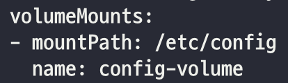

## helm 설치
- [Official Guide](https://helm.sh/ko/docs/intro/install/)

~~~
$ curl -fsSL -o get_helm.sh https://raw.githubusercontent.com/helm/helm/main/scripts/get-helm-3
$ chmod 700 get_helm.sh
$ ./get_helm.sh

# 아래는 적절한 helm repository 를 선택하면 된다. 
$ helm repo add prometheus-community https://prometheus-community.github.io/helm-charts
$ helm repo update
~~~

## helm 으로 prometheus 설치하기
~~~
$ helm install prometheus prometheus-community/prometheus
$ kubectl get po -l app=prometheus
~~~

잘 생성된 것 같다.

생성 후 명령어를 읽어보면 `server`, `alertmanager`, `pushgateway` 를 외부로 노출하는 명령어이다.

~~~
# server
$ export POD_NAME=$(kubectl get pods --namespace default -l "app=prometheus,component=server" -o jsonpath="{.items[0].metadata.name}")
$ kubectl --namespace default port-forward $POD_NAME 9090
# alertmanager
$ export POD_NAME=$(kubectl get pods --namespace default -l "app=prometheus,component=alertmanager" -o jsonpath="{.items[0].metadata.name}")
$ kubectl --namespace default port-forward $POD_NAME 9093
# pushgateway
$ export POD_NAME=$(kubectl get pods --namespace default -l "app=prometheus,component=pushgateway" -o jsonpath="{.items[0].metadata.name}")
$ kubectl --namespace default port-forward $POD_NAME 9091
~~~

`prometheus-server`를 NodePort로 노출하고 외부에서 접근해보자.

~~~
$ kubectl edit svc prometheus-server
~~~

31319로 NodePort를 세팅하고 접근해보자.  
각자 클라우드 세팅에 맞추어 로드밸런서를 생성하면 된다.

~~~
$ curl kubernetes-prometheus-10933306-06793331b562.kr.lb.naverncp.com:9090
~~~

## prometheus는 어디서 로그를 가져오고 있을까?
helm을 통해 prometheus를 세팅하면 위와같이 로그를 불러오고 있다. 어디서 로그를 불러오고 있는 것일까?
`prometheus-server` pod를 올릴 때에 mount된 configmap을 살펴보자.

~~~
$ kubectl get po prometheus-server-797db5db9d-tpqs7 -o yaml
~~~

~~~
$ kubectl get configmap prometheus-server -o yaml
~~~

prometheus의 다양한 설정들이 들어있다. 이 파일은 
`prometheus-server` pod의 `/etc/config` 경로에 mount 되었을 것이므로 직접 pod의 파일을 살펴보자.

~~~
$ kubectl exec prometheus-server-797db5db9d-tpqs7 -c prometheus-server -- cat /etc/config/prometheus.yml
~~~

`job_name` 단위로 끊어서 읽어보면 수많은 metric들을 여러 경로에서 수집하고 있는 것으로 짐작된다. 그 중 하나만 살펴보자.

kubernetes node에 대한 metric은 `kubernetes.default.svc:443` 의 `/api/v1/nodes/$1/proxy/metrics` 경로로 호출하여 수집하는 것으로 생각된다. 
직접 호출해보자. 호출하는 방법은 [ambassador pattern](../H_API/8_3_ambassador-pattern.md)을 참조한다.

~~~yaml
apiVersion: v1
kind: Pod
metadata:
  name: my-pod
spec:
  containers:
  - image: outgrow0905/hostname
    name: my-container
  - image: outgrow0905/kubectl-proxy
    name: my-proxy
~~~

~~~
$ kubectl exec -it my-pod -- /bin/bash
$ curl localhost:8001/api/v1/nodes/hello-kube-001/proxy/metrics
~~~

## Reference
- https://helm.sh/docs/intro/quickstart/
- https://www.cncf.io/blog/2020/10/07/important-reminder-for-all-helm-users-stable-incubator-repos-are-deprecated-and-all-images-are-changing-location/
- https://artifacthub.io/packages/helm/prometheus-community/prometheus
- https://boxboat.com/2019/08/08/monitoring-kubernetes-with-prometheus/