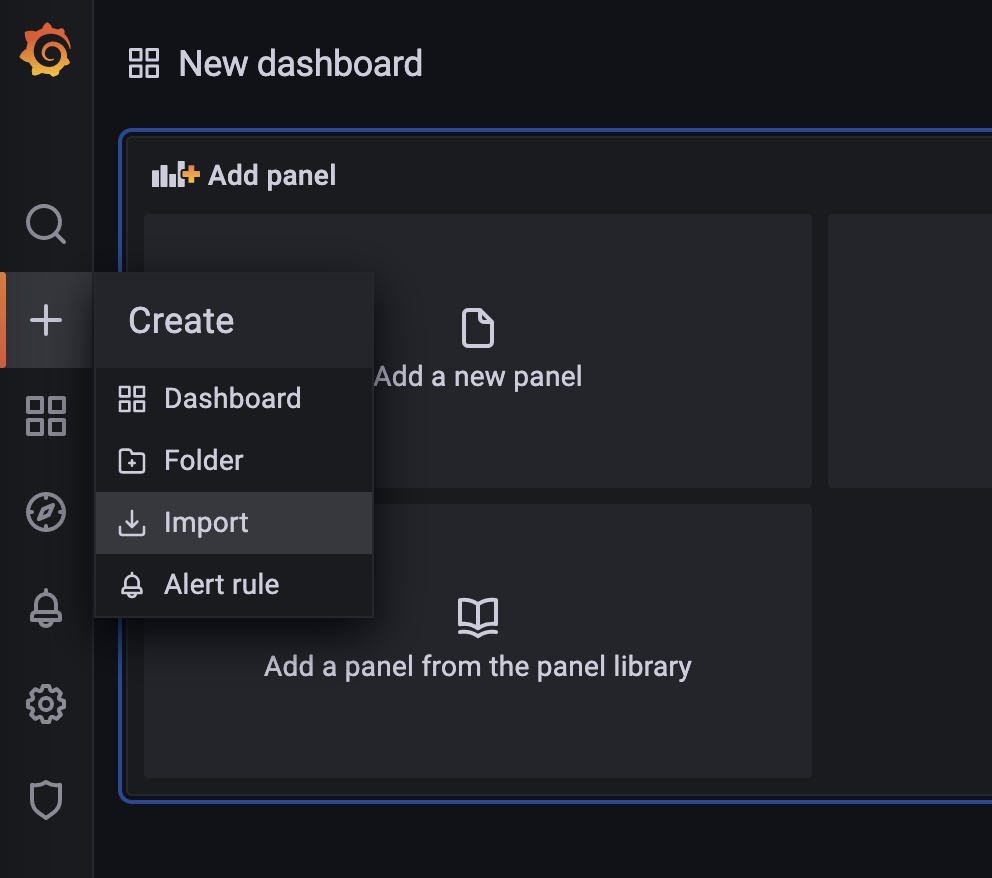
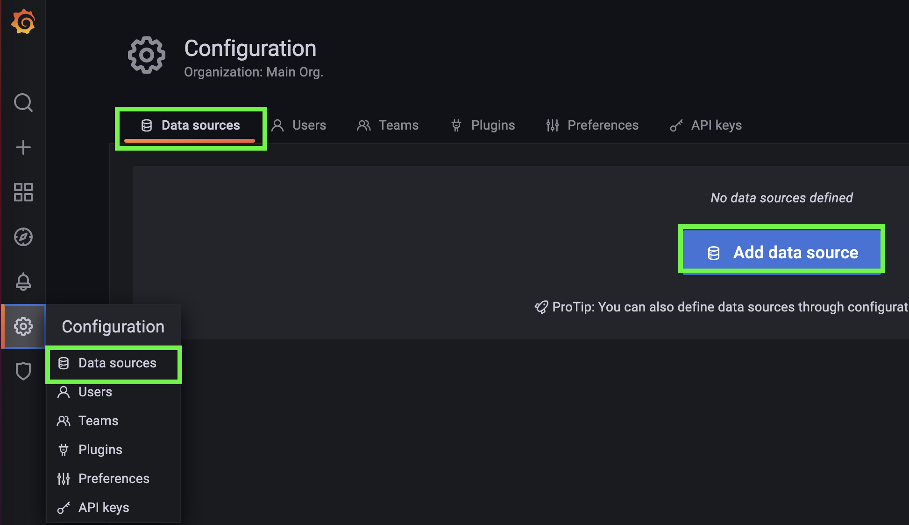
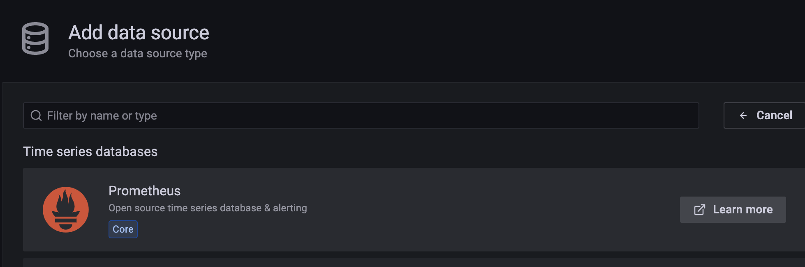
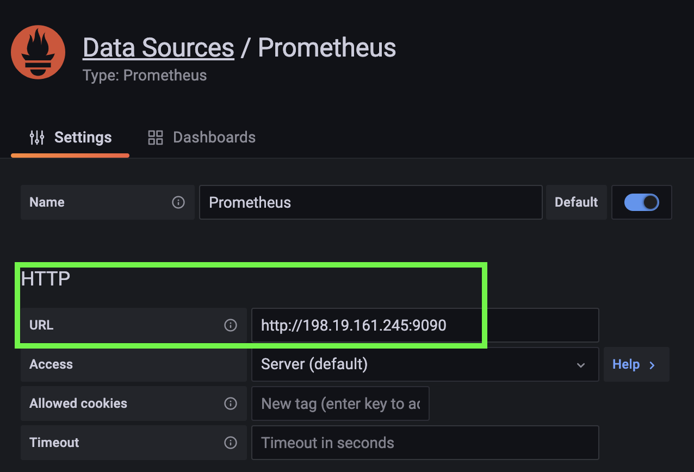
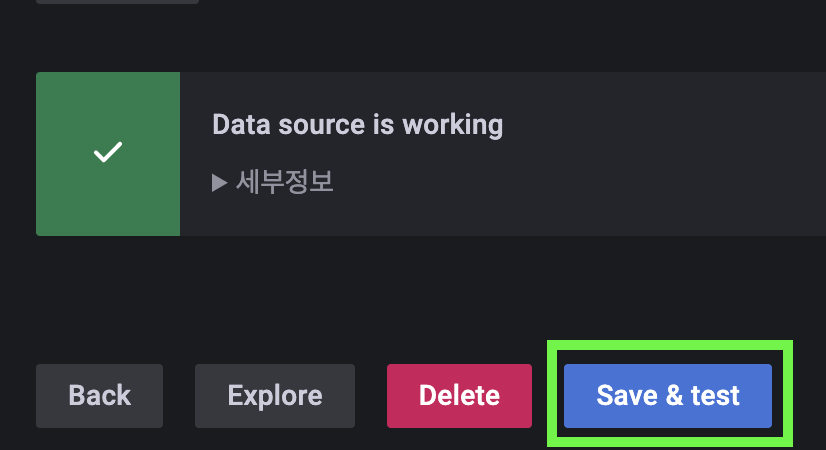
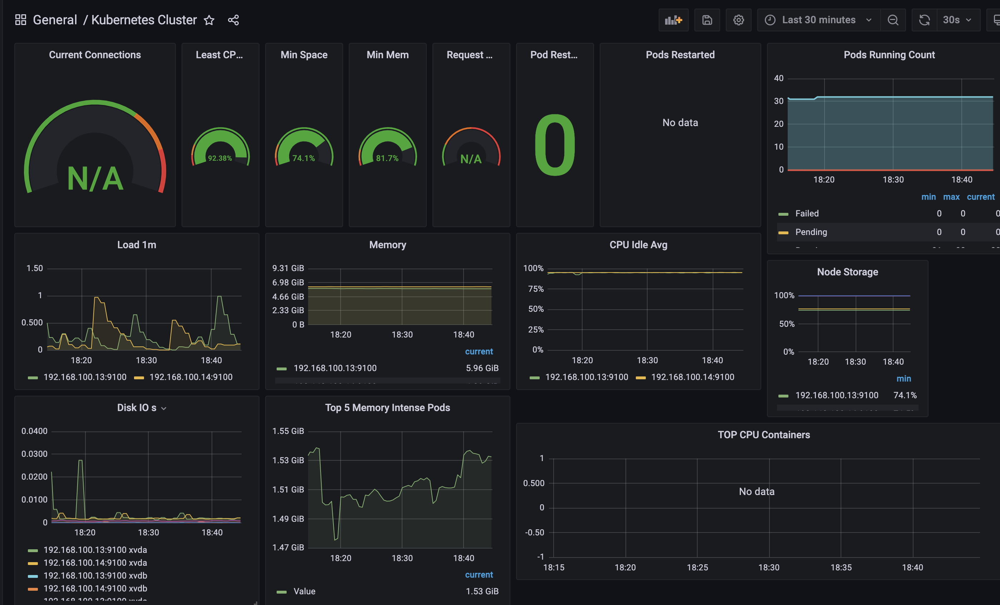

## Grafana 연동하기
~~~
$ helm repo add grafana https://grafana.github.io/helm-charts
$ helm repo update
$ git clone https://github.com/grafana/helm-charts.git
~~~

기본설정으로 설치할 경우에는 상관없지만, 미리 설정해야 할 부분이 있다면 아래와 같이 설정파일을 관리하는게 좋다.
~~~
$ vi helm-charts/charts/grafana/values.yaml
~~~

외부에서의 접근을 위해 필요한 경우 NodePort로 변경한다.

~~~yaml
service:
  enabled: true
  #type: ClusterIP
  type: NodePort
  nodePort: 30000
~~~

기본설정이 pvc를 사용하지 않고, emptyDir을 사용하기 때문에 로그 보존이 안된다. pvc 설정을 true로 변경한다.

~~~yaml
persistence:
  type: pvc
  #enabled: false
  enabled: true
~~~

필요한 경우 admin 계정과 비밀번호는 아래 부분에서 설정한다.

~~~yaml
adminUser: admin
adminPassword: ${password}
~~~

변경한 설정파일을 사용하여 grafana를 실행해보자.
~~~
$ helm install grafana grafana/grafana -f values.yaml
~~~

외부 접근을 위해 사용하는 클라우드에서 LoadBalancer를 적절히 설정하고 브라우저로 접근해보자.

~~~
kubernetes-prometheus-10933306-06793331b562.kr.lb.naverncp.com:30000
~~~

설정한 아이디와 패스워드로 로그인하고 prometheus로부터 metric을 수집하기위해 설정을 이어가보자. 수집할 url은 prometheus-server pod의 cluster ip를 입력한다.

Save & Test 를 클릭하고 아래와 같이 팝업이 뜬다면 설정성공이다.

데이터를 어떤 방식으로 보여줄 지 dashboard를 설정해야 한다.
prometheus는 7249나 8685를 범용적으로 사용한다.

