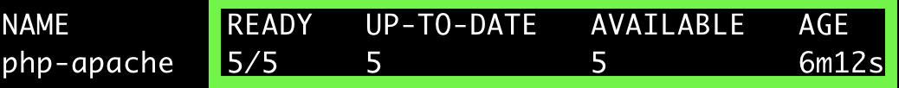

## HPA (Horizontal Pod Autoscaling)
[Resource Management](../M_ResourceManagement)에서 클러스터의 노드 혹은 각 Pod들의 metric들을 수집할 수 있게 되었다.  
이제 이것을 활용할 수 있다는 것이다. 어디에 활용할까?  
Pod의 cpu 사용량을 수집하고 있으니, 이를 기반으로 autoscale을 할 수 있다면 더할나위 없겠다.

아래와 같은 시나리오를 생각해보자.
~~~
resource: Deployment
replica: 2
cpu request: 100m
targetAverageUtilization: 30 # cpu request의 30%만 사용하고 싶다는 의미이다.
~~~

현재 cpu 사용율이 각 Pod에서 200m이라면, 아래와 같이 `desiredReplicas`를 계산해낼 수도 있겠다.

~~~
desiredReplicas = ceil(2 * 200m / 100m) = 4
~~~
   
위의 일련의 과정은 kubernetes HPA가 하는 일과 비슷하다. 실제 실습을 진행해보자.

## Practice 
##### cpu 부하를 일으키는 php 이미지 세팅
~~~php
<?php
  $x = 0.0001;
  for ($i = 0; $i <= 1000000; $i++) {
    $x += sqrt($x);
  }
  echo "OK!";
?>
~~~

~~~Dockerfile
FROM php:5-apache
COPY index.php /var/www/html/index.php
RUN chmod a+rx index.php
~~~

~~~
$ docker build -t outgrow0905/hpa-example .
$ docker push outgrow0905/hpa-example
~~~

##### Service, Deployment 세팅
~~~
apiVersion: apps/v1
kind: Deployment
metadata:
  name: php-apache
spec:
  selector:
    matchLabels:
      run: php-apache
  replicas: 1
  template:
    metadata:
      labels:
        run: php-apache
    spec:
      containers:
      - name: php-apache
        image: k8s.gcr.io/hpa-example
        ports:
        - containerPort: 80
        resources:
          limits:
            cpu: 500m
          requests:
            cpu: 200m
---
apiVersion: v1
kind: Service
metadata:
  name: php-apache
  labels:
    run: php-apache
spec:
  ports:
  - port: 80
  selector:
    run: php-apache
~~~

##### hpa 세팅
아래의 세팅은 cpu 부하 50을 유지하는 조건으로 컨테이너의 수를 최소 1개부터 최대 10개까지 운영할수 있다는 명령어이다.
~~~
$ kubectl autoscale deployment php-apache --cpu-percent=50 --min=1 --max=10
  horizontalpodautoscaler.autoscaling/php-apache autoscaled
$ kubectl get hpa
~~~

##### 부하 증가 및 모니터링
~~~
# 별도의 터미털에서 실행
$ kubectl run -i --tty load-generator --rm --image=busybox:1.28 --restart=Never -- /bin/sh -c "while sleep 0.01; do wget -q -O- http://php-apache; done"
~~~
~~~
$ kubectl get hpa php-apache --watch
~~~

cpu 부하가 250%로 올라가고 replica가 5개까지 늘어난 것을 볼 수 있다.

##### 부하제거 및 모니터링
부하를 중지하고 hpa가 줄어드는 것을 확인하자.

## autoscaling/v2
1.23v+ 부터는 hpa 리소스를 조회하면 아래와 같은 형식을 볼 수 있다.  
이전 버전에서 익숙한 `targetCPUUtilizationPercentage` 는 사라졌다.

~~~yaml
- type: Resource
    resource:
      name: cpu
      target:
        type: Utilization
        averageUtilization: 50
- type: Pods
    pods:
      metric:
        name: packets-per-second
      target:
        type: AverageValue
        averageValue: 1k
- type: Object
    object:
      metric:
        name: requests-per-second
      describedObject:
        apiVersion: networking.k8s.io/v1
        kind: Ingress
        name: main-route
      target:
        type: Value
        value: 10k
~~~

다양한 `type` 들이 존재하는데, 하나씩 살펴보자

##### Resource
cpu, memory 를 별도의 설정없이 기본으로 사용할 수 있다.  
`target.type`의 `Utilization` 대신 `AverageValue`를 사용하고,
`target.averageUtilization` 대신 `target.averageValue`를 사용하여, 직접적인 값을 설정할 수도 있다.

##### Pods
위의 Resource metric과 유사하다. 다만, `AverageValue`만 사용할 수 있다.

##### Object
같은 namespace 내의 다른 리소스를 모니터링하여 hpa의 metric으로 사용할 수 있다. 
위의 예시에서는, `main-route` 이름의 Ingress 리소스의 `requests-per-second` metric을 hpa의 metric으로 사용한다.

## Reference 
- https://kubernetes.io/docs/tasks/run-application/horizontal-pod-autoscale/
- https://kubernetes.io/docs/tasks/run-application/horizontal-pod-autoscale-walkthrough/