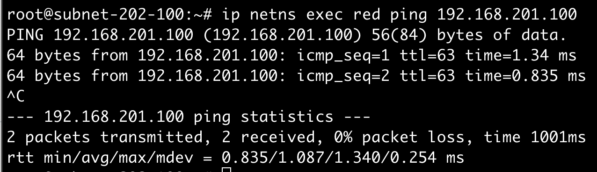

## Linux Network Namespace
linux network namespace의 동작을 연습해보자.  

## setUp
~~~
host1: 192.168.100.8/24
host2: 192.168.100.9/24
~~~

### 하나의 호스트에서 두 개의 network namespace를 생성하고 namespace간 통신가능하도록 설정
두 개의 network namespace 생성
~~~
$ ip netns add red
$ ip netns add blue
$ ip netns
~~~

각 namespace에서 네트워크 설정 확인해보면, loopback 밖에 없음을 확인할 수 있다.
~~~
$ ip -n red link
$ ip -n blue link
~~~

arp 테이블을 조회해도 아직 아무것도 없다.
~~~
$ ip netns exec red arp
$ ip netns exec blue arp
~~~

route 테이블도 마찬가지이다.
~~~
$ ip netns exec red route
$ ip netns exec blue route
~~~

두 namespace를 이어주는 가상 이더넷 케이블을 생성해보자.
~~~
$ ip link add veth-red type veth peer name veth-blue
~~~ 

가상 이더넷 케이블을 각각의 namespace에 연결해보자.
~~~
$ ip link set veth-red netns red
$ ip link set veth-blue netns blue
~~~

각각의 namespace에 네트워크 인터페이스가 생성되었다.
~~~
$ ip -n red link
$ ip -n blue link
~~~

각각의 namespace로 연결한 veth의 ip를 부여해보자.
~~~
$ ip -n red addr add 192.168.15.1/24 dev veth-red
$ ip -n blue addr add 192.168.15.2/24 dev veth-blue

$ ip -n red link set veth-red up
$ ip -n blue link set veth-blue up
~~~ 

ping 을 날려보자.
~~~
$ ip netns exec red ping 192.168.15.2
~~~

arp 에도 잘 추가가 되었다.
~~~
$ ip netns exec red arp
$ ip netns exec blue arp
~~~

##### 한 호스트 내의 가상 브릿지를 두고 namespace간 통신
위의 방식으로 두 namespace간 통신을 연습해보았다. 만약 여러 namespace가 있다면 어떻게 해야 할까?
하나의 브릿지를 두고 브릿지를 통해 통신하는 것이 효율적일 것이다.

linux에서 지원하는 가상 브릿지를 추가해보자.
~~~
$ ip link add v-net-0 type bridge
$ ip link set dev v-net-0 up
$ ip link | grep v-net-0
~~~

중앙에 브릿지를 두고 각각의 namespace가 붙어야 하므로, 이전에 생성했던 가상 이더넷은 제거하자.
~~~
$ ip -n red link del veth-red
~~~

브릿지는 브릿지끼리 통신해야 한다(?)
따라서, 각각의 namespace에서 브릿지로 통신할 수 있도록 namespace별 브릿지를 생성하고 가상 이더넷과 연결한다.
~~~
$ ip link add veth-red type veth peer name veth-red-br # veth-red 이더넷을 veth-red-br 와 연결한다.
$ ip link set veth-red netns red # veth-red 이더넷을 red namespace에 할당한다.
$ ip link set veth-red-br master v-net-0 # veth-red-br 브릿지를 v-net-0 와 연결한다.
$ ip -n red addr add 192.168.15.1/24 dev veth-red # veth-red 이더넷에 아이피를 할당한다.
$ ip -n red link set veth-red up # veth-red 이더넷을 활성화한다.
$ ip link set up dev veth-red-br # veth-red-br 브릿지를 활성화한다.

$ ip link add veth-blue type veth peer name veth-blue-br
$ ip link set veth-blue netns blue
$ ip link set veth-blue-br master v-net-0
$ ip -n blue addr add 192.168.15.2/24 dev veth-blue
$ ip -n blue link set veth-blue up
$ ip link set up dev veth-blue-br
~~~ 

위의 설정은 브릿지를 두고 namespace간의 통신이 가능하도록 하는 설정들이다.
host로부터 namespace로 통신이 가능하지는 않다. 
현재 아래의 통신은 불가능하다. 

~~~
$ ping 192.168.15.1
~~~

이를 위해서는 아래의 설정을 한다.

~~~
$ ip addr add 192.168.15.5/24 dev v-net-0
~~~

## namespace에서 다른 호스트와 통신하기 
위의 예시를 통해 호스트 내에서 브릿지를 통해 namespace간 통신, 호스트와 namespace간의 통신에 대하여 연습헀다.    
특정 호스트 내의 namespace에서 다른 호스트와의 통신을 하려면 어떻게 해야 할까? 

~~~
host1: 192.168.202.100/24
host2: 192.168.201.100/24
~~~

hos1에 속한 red namespace에서 host2로 연결을 하고자 한다. 실패한다.
~~~
$ ip netns exec red ping 192.168.201.100
~~~

red namespace에서 route 설정을 확인해보자.
~~~
$ ip netns exec red route
~~~

route 설정을 해보자.
~~~ 
$ ip netns exec red ip route add 192.168.201.0/24 via 192.168.15.5
~~~

다시 ping을 날려보자.  
route 설정을 하니 UnReachable은 사라졌지만, 역시 작동까지는 하지 않는다.

red namespace에 브릿지의 주소인 `192.168.15.5`로 나가도록 했으니, 
호스트인 `192.168.201.100`가 gateway 역할을 하게 된 셈이다.

생각해보니 이상하다.  
host1에서는 host2로 `ping 192.168.202.100` 이 잘 작동하기 때문이다.  
host1에서 날리는 ping은 잘 작동하고, red namespace에서 잘 넘어온 ping은 왜 전달이 안되는걸까?

두 통신의 차이는 source ip에 있다. host2는 host1을 알지만, 
red namespace `192.168.15.1 `은 모른다. 당연히 모른다. 모르는데 어떻게 응답을 주겠는가?

그럼 host1의 역할은 red namespace로 부터 넘어온 트레픽을 외부로 전달할 때에 마치 자신이 source인 것처럼 NAT 해주어야 하는 것이다.  
그게 host로써 마땅한 역할일 것이다.

~~~
$ iptables -t nat -A POSTROUTING -s 192.168.15.0/24 -j MASQUERADE
~~~

하지만, 작동을 안한다. linux는 보안상의 이유로 다른 호스트로부터 들어온 패킷을 그대로 전달하는 gateway의 역할을 하지 않도록 되어있다.
이 설정이 `cat /proc/sys/net/ipv4/ip_forward`에 들어있다.
아래 설정으로 바꿔주자.

~~~
$ echo 1 > /proc/sys/net/ipv4/ip_forward
~~~

## namespace에서 인터넷 통신하기
위의 설정을 이어가면서 namespace에서 인터넷 통신도 가능하도록 해보자.  
먼저, 지금의 상태를 보자.

~~~
$ ip netns exec red ping 8.8.8.8
~~~

안된다. route 할 경로를 못찾기 때문일 것이다.
추가해보자.

~~~
$ ip netns exec red ip route add default via 192.168.15.5
~~~

## host2에서 host1의 namespace로 통신하기
위의 예제를 통해 특정 namespace에서 외부 host로 통신하는 방법을 알아보았다.  
그럼, 외부 host에서 특정 namespace와 통신을 하려면 어떻게 해야 할까?

host2에서 host1의 red namespace로 ping을 날려보자.  

~~~
$ ping 192.168.15.1
~~~

당연히 안된다. 말도 안된다. `192.168.15.1`이 누구인지 모르기 때문이다.
방법을 찾아보자.  
host1 입장에서, 특정 port로 들어온 모든 요청은 특정 namespace로 들어온 요청으로 간주하고 관리하도록 하는 것이 방법이다.  
이 방법이 `portforwarding`이다.

host1에서 아래의 명령어를 통해 `portforwarding`을 설정하면 된다.

~~~
$ iptables -t nat -p tcp -A PREROUTING --dport 80 -j DNAT --to-destination 192.168.15.1:80
~~~

