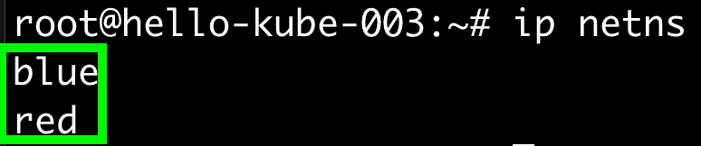
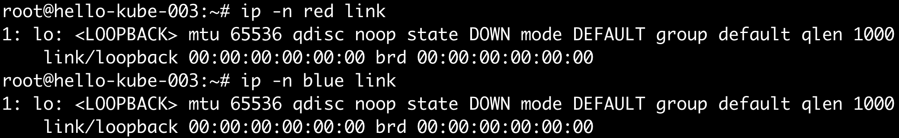
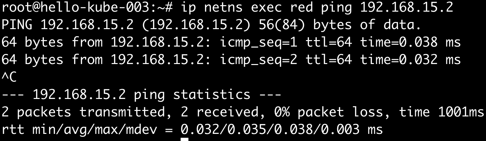
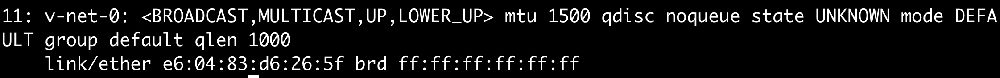

## Linux Network Namespace
linux network namespace의 동작을 연습해보자.  

## setUp
~~~
host1: 192.168.100.8/24
host2: 192.168.100.9/24
~~~

##### 하나의 호스트에서 두 개의 network namespace를 생성하고 namespace간 통신가능하도록 설정
두 개의 network namespace 생성
~~~
$ ip netns add red
$ ip netns add blue
$ ip netns
~~~

각 namespace에서 네트워크 설정 확인해보면, loopback 밖에 없음을 확인할 수 있다.
~~~
$ ip -n red link
$ ip -n blue link
~~~

arp 테이블을 조회해도 아직 아무것도 없다.
~~~
$ ip netns exec red arp
$ ip netns exec blue arp
~~~

route 테이블도 마찬가지이다.
~~~
$ ip netns exec red route
$ ip netns exec blue route
~~~

두 namespace를 이어주는 가상 이더넷 케이블을 생성해보자.
~~~
$ ip link add veth-red type veth peer name veth-blue
~~~ 

가상 이더넷 케이블을 각각의 namespace에 연결해보자.
~~~
$ ip link set veth-red netns red
$ ip link set veth-blue netns blue
~~~

각각의 namespace에 네트워크 인터페이스가 생성되었다.
~~~
$ ip -n red link
$ ip -n blue link
~~~

각각의 namespace로 연결한 veth의 ip를 부여해보자.
~~~
$ ip -n red addr add 192.168.15.1/24 dev veth-red
$ ip -n blue addr add 192.168.15.2/24 dev veth-blue

$ ip -n red link set veth-red up
$ ip -n blue link set veth-blue up
~~~ 

ping 을 날려보자.
~~~
$ ip netns exec red ping 192.168.15.2
~~~

arp 에도 잘 추가가 되었다.
~~~
$ ip netns exec red arp
$ ip netns exec blue arp
~~~

##### 한 호스트 내의 가상 브릿지를 두고 namespace간 통신
위의 방식으로 두 namespace간 통신을 연습해보았다. 만약 여러 namespace가 있다면 어떻게 해야 할까?
하나의 브릿지를 두고 브릿지를 통해 통신하는 것이 효율적일 것이다.

linux에서 지원하는 가상 브릿지를 추가해보자.
~~~
$ ip link add v-net-0 type bridge
$ ip link set dev v-net-0 up
$ ip link | grep v-net-0
~~~

중앙에 브릿지를 두고 각각의 namespace가 붙어야 하므로, 이전에 생성했던 가상 이더넷은 제거하자.
~~~
$ ip -n red link del veth-red
~~~

브릿지는 브릿지끼리 통신해야 한다(?)
따라서, 각각의 namespace에서 브릿지로 통신할 수 있도록 namespace별 브릿지를 생성하고 가상 이더넷과 연결한다.
~~~
$ ip link add veth-red type veth peer name veth-red-br # veth-red 이더넷을 veth-red-br 와 연결한다.
$ ip link set veth-red netns red # veth-red 이더넷을 red namespace에 할당한다.
$ ip link set veth-red-br master v-net-0 # veth-red-br 브릿지를 v-net-0 와 연결한다.
$ ip -n red addr add 192.168.15.1/24 dev veth-red # veth-red 이더넷에 아이피를 할당한다.
$ ip -n red link set veth-red up # veth-red 이더넷을 활성화한다.

$ ip link add veth-blue type veth peer name veth-blue-br
$ ip link set veth-blue netns blue
$ ip link set veth-blue-br master v-net-0
$ ip -n blue addr add 192.168.15.2/24 dev veth-blue
$ ip -n blue link set veth-blue up
~~~ 

위의 설정은 브릿지를 두고 namespace간의 통신이 가능하도록 하는 설정들이다.
host로부터 namespace로 통신이 가능하지는 않다. 이를 위해서는 아래의 설정을 한다.

~~~
$ ip addr add 192.168.15.5/24 dev v-net-0
~~~