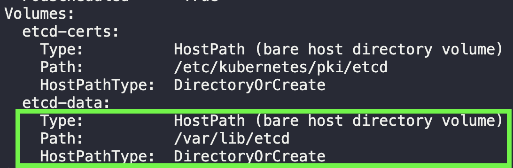

## etcdctl
`etcd`는 kubernetes의 모든 정보를 저장하는 저장소이며, 별개의 오픈소스이다.  
저장소인만큼 백업, 스냅샷의 기능을 제공한다. 이를 활용하여 kubernetes 의 특정상태를 스냅샷으로 저장할 수 있고,
이 스냅샷을 통해 데이터를 복구할 수도 있다. 아래를 따라해보자.

##### practice
~~~
# snapshot 생성
$ etcdctl snapshot save snapshot.db 

# /var/lib/etcd-from-backup 경로에 snapshot.db를 복구함
$ etcdctl snapshot restore snapshot.db --data-dir /var/lib/etcd-from-backup

# etcd Pod에서 /var/lib/etcd-from-backup의 경로를 사용하여 프로세스가 실행되도록 한다.
# etcd Pod가 실행 될 때 사용하는 볼륨의 경로는 아래 사진을 참조해보자.  
~~~

~~~
# static Pod라면 `staticPodPath`에서 etcd.yaml 파일을 수정해주면 되겠다. /var/lib/etcd-from-backup 경로를 사용하도록 변경한다.
~~~

##### etcdctl을 사용하지 않고 백업하기
`etcd` Pod 혹은 서버에 접근이 불가능하다면, 아래와 같이 모든 설정들을 저장해둘 수 있다.
~~~
$ kubectl get all --all-namespaces > backup.yaml
~~~

## Reference
- https://kubernetes.io/docs/tasks/administer-cluster/configure-upgrade-etcd/